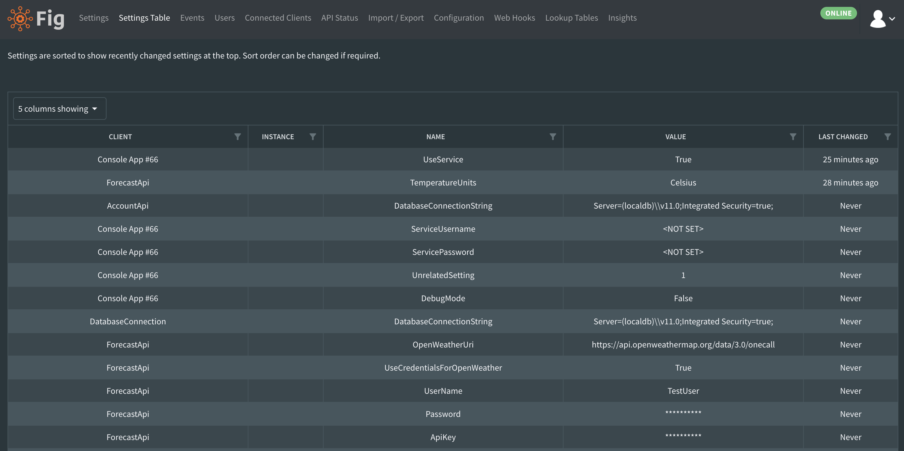

# Settings Table

All settings can be reviewed in table format which includes when the settings where last. This can be useful when trying to search for specific settings or review recent changes in an easy to review format. All columns can be filtered or sorted as required.

All values are read only in this view.

  
*The settings table view allows users to view all settings in a table format*
