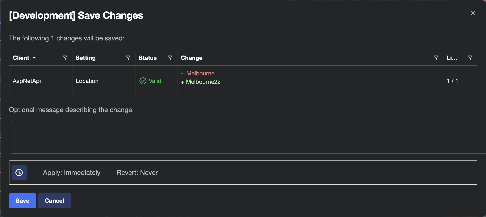
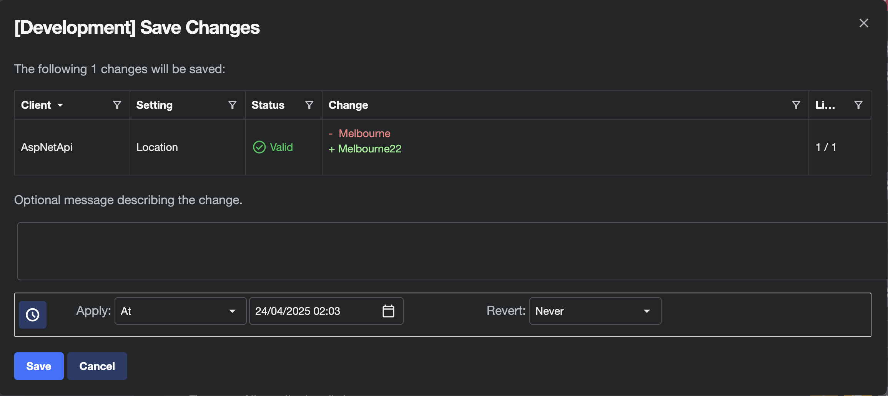
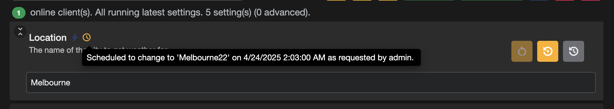
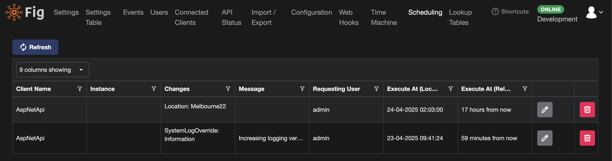

# Scheduling

The Scheduling feature in Fig allows users to defer the application of setting changes or schedule the automatic reverting of settings changes to a later time.

There are many potential applications of this including:

- Preparing changes to be applied during a later change window
- Testing a set of changes temporarily with automatic reversion
- Increasing logging verbosity with automatic reversion to avoid long term performance problems
- Changing a setting for a short duration during the nigh time for additional logging or troubleshooting purposes

## Scheduling a change

### Deferring a Change

When saving changes to one or more settings across one or more clients, users have the ability to review the changes and add a change message prior to saving. They also have the ability to schedule a time when the changes should be applied.

By default, scheduling options are collapsed and not applied. However, by clicking the scheduling button at the bottom of the dialog, they become editable.

Users have the option to apply the change:

- `Immediately` (default)
- `At` a specific point in time
- `In` a specific timespan from the current time

If an `At` or `In` option is chosen, the apply time is calculated and sent to the server. Any pending changes within the UI are reverted back to original values as the change is not yet active.

When the time comes for the change to be applied, it will be applied on the server and the client application will receive a notification that its settings are out of date and the page needs to be refreshed.

### Reverting a Change

Using the same change dialog, it is possible to revert a change. The revert options live alongside the apply options and allow a date and time or timespan to be selected for when the revert process should occur.

Upon saving, the changes are applied (assuming no deferred apply) and a scheduled change is created to revert the values back to how they were prior to the apply.

### Deferred apply and revert

It is possible to use the deferred apply and revert options together to delay the applying of a setting as well as automatically reverting. However, please note the following:

- The revert date must be after the apply date (or saving will be disabled)
- When the revert is applied, it will revert to the value of the setting when the apply took place, not when the setting was originally saved. This means if the setting was changed again prior to the deferred changeset being applied, it will revert to the updated value rather than the original.
- Only one scheduled change will be visible, the revert scheduled change will be created once the apply is complete.

## Managing Scheduled Changes

### Pending Scheduled Change

When a change has been scheduled for a particular setting, an icon will be shown on that setting with a tooltip describing the pending change.

This will alert users to the fact that the value will change in the future.

### Scheduling Page

Administrators can also see all scheduled changes on the dedicated Scheduling page. This page shows details of the settings that will be changed.

From this page, Administrators are also able to reschedule changes but adjusting the date and time when they will be applied as well as delete pending changes.

If a pending change is deleted, it will never be applied.

## Scheduling Accuracy

By default, Fig will check for scheduling changes every 30 seconds. This can be changed in the Fig.Api `appSettings.json` file. At a 30 second frequency, scheduling options will be accurate to approximately to the minute, assuming a 30 poll interval of the clients.
