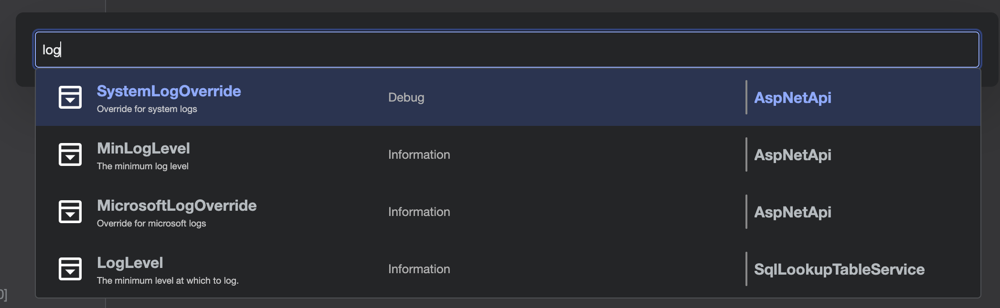
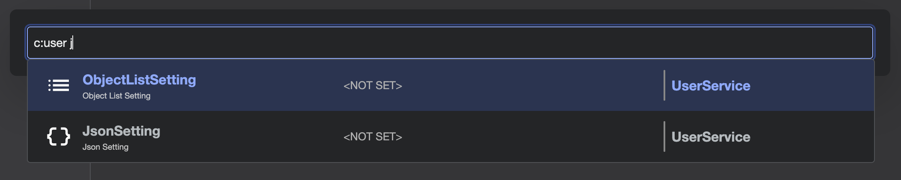

# Find / Search

The Find / Search feature in Fig allows you to quickly locate and navigate to any setting across all clients and instances. You can open the search dialog using the keyboard shortcut <kbd>Alt</kbd> + <kbd>F</kbd> or by pressing the magnifying glass in the nav bar.



## How It Works

When the search dialog is opened, a powerful search box appears, allowing you to filter settings using free text or advanced tokens. As you type, results are shown instantly in the dropdown below.

Selecting an item from the list either by keyboard or mouse will select the approproiate setting client, scroll to the selected setting and highlight it. If the setting is advanced, that will be toggled on.

### Search Tokens

By default, the search works by breaking up the query text into tokens separated by space. All tokens must match either setting name, client name or instance name.

For example:

```text
user log main
```

Might match a setting called `LogLevel` in a client called `User Settings` with an instance `main`.

In addition, it is possible to refine the search using the following tokens:

- `client:` or `c:` — Filter by client name (e.g., `client:myservice`)
- `setting:` or `s:` — Filter by setting name (e.g., `s:timeout`)
- `description:` or `d:` — Filter by description text (truncated value only)
- `instance:` or `i:` — Filter by instance name
- `value:` or `v:` — Filter by current value (truncated value only)

You can combine tokens and general search terms. For example:

```text
client:api s:loglevel debug
```

This finds all settings named "loglevel" in clients with "api" in their name, and also matches "debug" in either setting name, client name or instance name.



### Search Results

Each result displays:

- The setting name
- An icon representing the settings type
- Icon colored based on the category color of the setting
- A truncated version of the setting description
- A truncated version of the current value
- The parent client and instance

Selecting a result will:

- Automatically select the relevant client and instance
- Expand the setting in the UI
- Scroll to and highlight the setting for easy editing

### Advanced Features

- **Keyboard Navigation:** Use arrow keys to move through results and <kbd>Enter</kbd> to select.
- **Advanced/Hidden Settings:** If a setting is marked as advanced, it will be revealed automatically when selected from search.
- **Instant Filtering:** Results update as you type, with support for partial matches and multiple criteria.
- **All Settings:** Type a character and then backspace to see all available settings, then select one using keyboard or mouse navigation.
- **Closing the Dialog:** To close the dialog, either select an item from the list, click outside the dialog or press <kbd>Esc</kbd>
