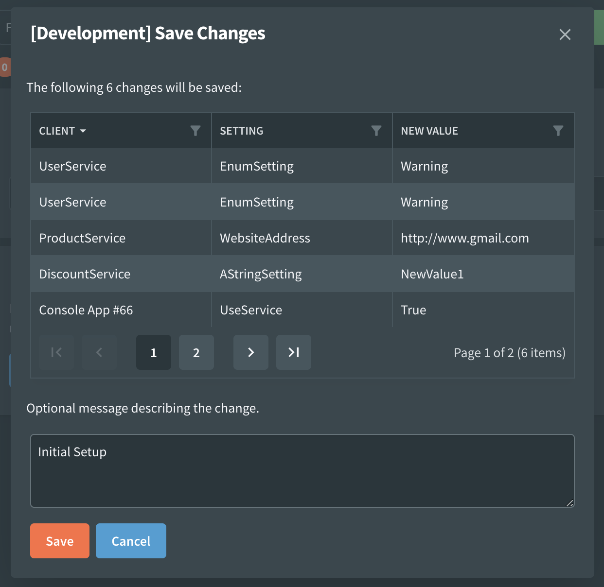

# Change Message

When you save settings changes, you will be prompted to enter a change message. This message will be stored in the event log along with the value changes. It can be a good way to record the motivation behind the change.

In addition to capturing the change message, the popup window will also display a list of all the settings that will be saved as part of the change. This is a good opportunity to review the changes before they are persisted.

The current environment is also shown in the heading of the popup.

