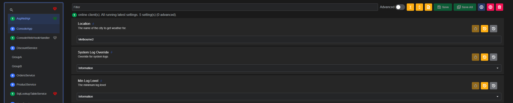
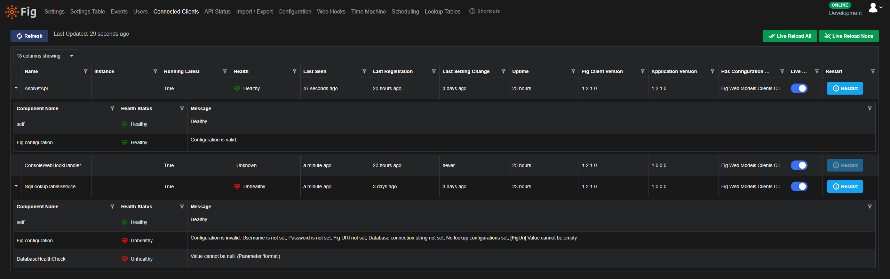
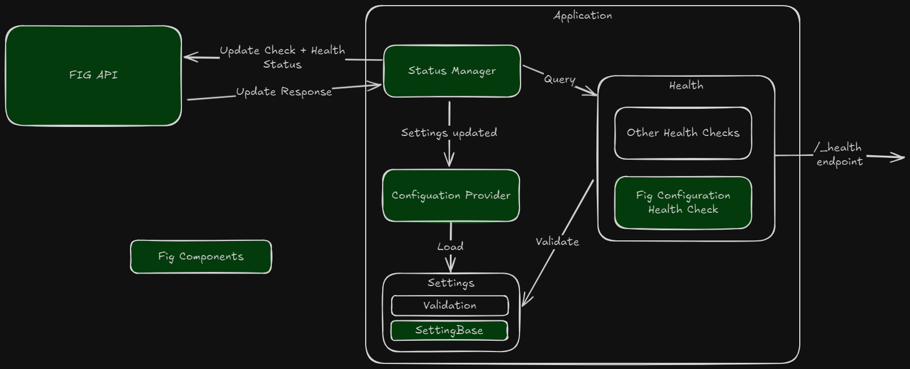

# Health Checks

When the fig client is registered in the program.cs file, it enables [health checks](https://learn.microsoft.com/en-us/aspnet/core/host-and-deploy/health-checks?view=aspnetcore-9.0) for an ASP.NET application. Health Checks provide a mechanism to query an application and understand its health state.

Typically, applications should include health checks for all components as part of the overall health check. This might include third party dependencies such as databases, message busses, caches, or API's. Each of these can be registered as their own health check and are added as components to the overall heath of the application.

The Fig.Client internally queries the health check on every poll cycle and sends the result to the API. This information is then used for event log and web hook generation when the health state changes.

The information is also then available within the web application.

## Inspecting Health

Health is displayed in 2 places:

- In the main settings page - here an icon shows an aggregated state of all running instances of an application. All instances must be healthy in order for the icon to show healthy. An additional aggregated state of all instances is shown at the top.

  
*Aggregated health checks show the status of all running instances*

- In the connected clients page - Here an icon is shown for each running instances. Instances can be expanded to show all health details.

  
*You can see the health of each component within the application*

## Health States

Health may be one of the following:

- **Healthy (green)** - everything is working as expected
- **Unhealthy (red)** - the application is not working as expected
- **Degraded (orange)** - the application is running but with limited functionality
- **Unknown (grey)** - the application is running but not providing health information. This might be because it is running an earlier version of the Fig.Client library or has not registered fig correctly.

## Fig Configuration Health Check

In addition to reading existing health checks, Fig also registers its own health check. The health check is designed to show that the application is configured correctly.

To decide this, it does the following:

1. Calls the `GetValidationErrors()` method which must be implemented in your settings class. This method provides an opportunity to perform complex validations on settings including checking relationships between settings and return their state.
2. Runs all `[Validation]` attributes on any settings where they are present. It is possible to exclude settings from this validation, see [Validation](./settings-management/20-validation.md) for more details.

Note for performance reasons, the health check result is cached and only checked after settings have changed.

## Architecture

The health check architecture is shown below:

  
*Health Check Architecture*
