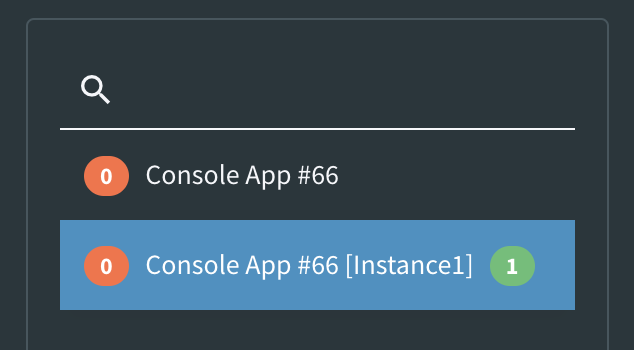

# Instances

Fig supports overriding the default settings for a client with an instance. An instance is a special key that can be passed by the calling client. When an instance is provided, Fig attempts to find settings matching that instance name. If none are found, the default settings for that client are returned.

Instances can be created by selecting the client and pressing the instance button.


Once the instance is created, there will be two items in the clients list for that client.



These settings can be set individually. If a client requests settings with no instance or an instance other than 'Instance1' (in the example above) then they will be given the default settings.

If a client requests settings with instance 'Instance1', they will be provided with those specific settings.

## Setting an Instance on a Client

Instances are set via environment variable. The name of the environment variable will vary depending on the client name (without spaces).

```yaml
FIG_<CLIENT NAME>_INSTANCE
```

For example:

```yaml
FIG_MYCLIENT_INSTANCE
```
