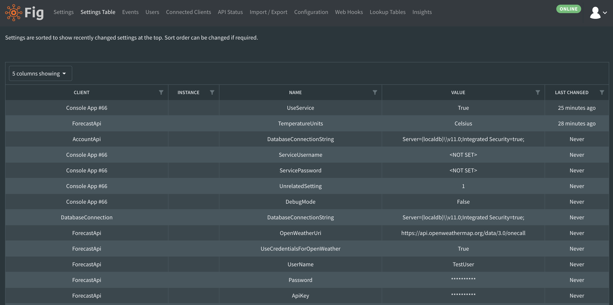

# Settings Table

All settings can be reviewed in table format, including when they were last changed. This is useful when searching for specific settings or reviewing recent changes. All columns can be filtered or sorted as required.

All values are read only in this view.

  
*The settings table view allows users to view all settings in a table format*
