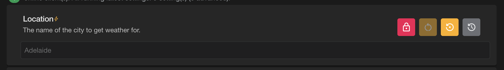

# Externally Managed Settings

When using Fig with a CICD pipeline, you may want some or all settings to be managed by that pipeline (e.g. stored in git). In this case, you might use the [powershell module](https://github.com/mzbrau/fig/blob/main/scripts/fig-sdk.psm1) to import setting values into Fig so they can be read by the applications.

If these settings are written on every deploy, you won't want someone editing the values within Fig as the value will just be overriden. In this case, you can mark the setting as 'externally managed'. This makes it read only in Fig.

Settings can be marked as externally managed in the following ways.

## Via Value Only Import

### Globally

Add the attribute at the top of the import.

```json
{
  "ExportedAt": "2025-02-07T20:28:16.175812Z",
  "ImportType": 3,
  "Version": 1,
  "IsExternallyManaged": true,
  "Clients": [
    {
      "Name": "AspNetApi",
      "Instance": null,
      "Settings": [
        {
          "Name": "Location",
          "Value": "Adelaide"
        },
        {
          "Name": "MicrosoftLogOverride",
          "Value": "Information"
        }
      ]
    }
  ]
}
```

### Per Setting

Alternatively you can mark individual settings as being externally managed. This is only supported for value only imports.

```json
{
  "ExportedAt": "2025-02-07T20:28:16.175812Z",
  "ImportType": 3,
  "Version": 1,
  "Clients": [
    {
      "Name": "AspNetApi",
      "Instance": null,
      "Settings": [
        {
          "Name": "Location",
          "Value": "Adelaide",
          "IsExternallyManaged": true
        },
        {
          "Name": "MicrosoftLogOverride",
          "Value": "Information"
        }
      ]
    }
  ]
}
```

### A combination of both

```json
{
  "ExportedAt": "2025-02-07T20:28:16.175812Z",
  "ImportType": 3,
  "Version": 1,
  "IsExternallyManaged": true,
  "Clients": [
    {
      "Name": "AspNetApi",
      "Instance": null,
      "Settings": [
        {
          "Name": "Location",
          "Value": "Adelaide",
          "IsExternallyManaged": false
        },
        {
          "Name": "MicrosoftLogOverride",
          "Value": "Information"
        }
      ]
    }
  ]
}
```

## Automatic Detection

Fig can automatically detect when settings are overridden by other configuration providers. Since Fig is a configuration provider, settings can be overridden by providers that are registered after Fig in the configuration chain (e.g. environment variables, command line arguments, or other custom providers).

When a Fig client application starts, it compares the values provided by Fig with the actual values in the final configuration. If any values differ, those settings are automatically flagged as externally managed and the overridden values are sent back to the API.

This detection happens once after startup. The externally managed flag is latching - once set, it can only be cleared via a value only import explicitly setting `IsExternallyManaged` to `false`.

### How it works

1. The Fig client loads settings from the API
2. After the application configuration is built, a background service compares Fig values with actual configuration values
3. Any differences are reported back to the API during the next status sync
4. The API updates the settings as externally managed and records the new values in the event log

### Important Notes

- If you have multiple run sessions and only one is overriding a value, the setting will still be marked as externally managed
- Other instances will receive the overridden value as it's treated like any other setting update
- The value change is logged in the event log as being updated by an external configuration provider

## Client Display

Any setting that is externally managed will be shown read only in the UI.



When the user clicks the red padlock, they will be prompted to confirm that they understand the setting is externally managed and then they will be allowed to edit the setting again as normal.

When a change is made to an externally managed setting:

- A warning is shown to the user before save
- An addition event log is added indicating that an externally managed setting was changed.
