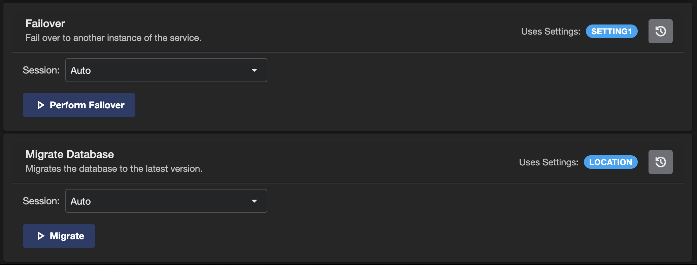
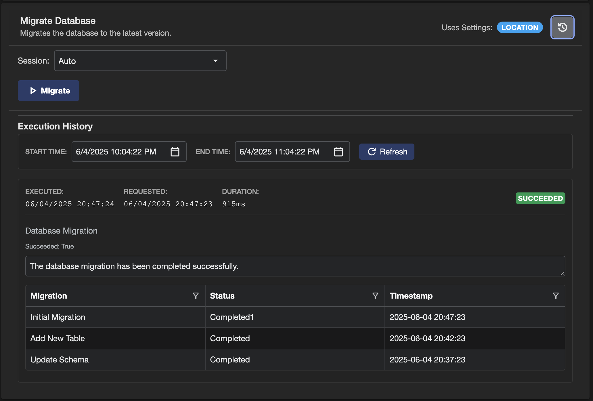
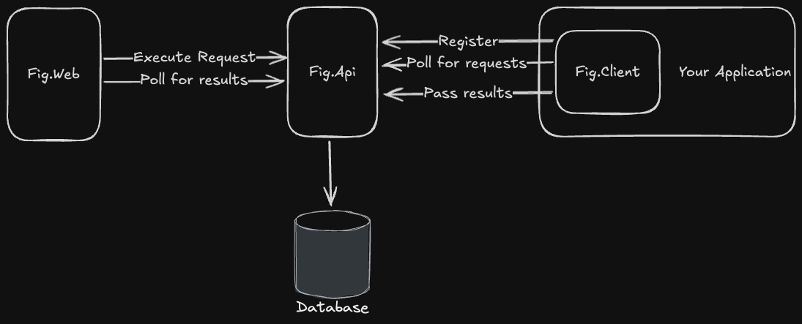
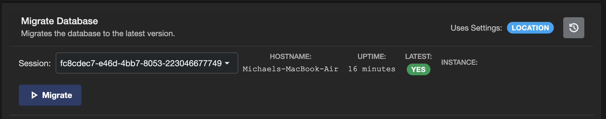

# Custom Actions

Custom Actions in Fig allow you to define executable operations in your applications that can be triggered from the Fig web interface. These actions provide a way to perform administrative tasks, maintenance operations, query information, diagnostics checks or other custom behaviors directly from your settings management interface.

It is a way of adding a simple user interface to back end services.

## Overview

Custom Actions are client-side operations that:

- Are defined and implemented within your application
- Are registered automatically with the Fig API when your application starts
- Can be executed on-demand from the Fig web interface
- Return structured results including text output and data grids
- Support execution targeting specific client instances
- Provide execution history and status tracking

## Implementation

### Creating a Custom Action

Custom Actions implement the `ICustomAction` interface:

```csharp
using Fig.Client.CustomActions;
using System.Runtime.CompilerServices;

public class FailoverAction : ICustomAction
{
    public string Name => "Failover";
    public string ButtonName => "Perform Failover";
    public string Description => "Fail over to another instance of the service.";
    public IEnumerable<string> SettingsUsed => ["DatabaseConnectionString", "BackupEndpoint"];

    public async IAsyncEnumerable<CustomActionResultModel> Execute([EnumeratorCancellation] CancellationToken cancellationToken)
    {
        yield return ResultBuilder.CreateSuccessResult("Failover Initiated");
    }
}
```

### Returning results as part of the action

Actions return a collection of results. Each result can contain:

- Name
- Text Result
- Data Grid Result

Results can be created directly but there is a builder which simplifies the process.

#### Text Results

```csharp
ResultBuilder.CreateSuccessResult("Database Migration")
            .WithTextResult("Database migration completed successfully.");
```

#### Data Grid Result

```csharp
var migrationResults = new List<MigrationResult>
        {
            new("001_CreateUserTable", "Completed", DateTime.UtcNow.AddMinutes(-5)),
            new("002_AddIndexes", "Completed", DateTime.UtcNow.AddMinutes(-3)),
            new("003_UpdateSchema", "Completed", DateTime.UtcNow.AddMinutes(-1))
        };

        yield return ResultBuilder.CreateSuccessResult("Database Migration")
            .WithDataGridResult(migrationResults);

public record MigrationResult(string Migration, string Status, DateTime Timestamp);
```

It is also possible to return both a text and data grid result in the same result object.

## Registration and Dependency Injection

All actions must be registered with the dependency injection container so they can be discovered by Fig. For example:

```csharp
builder.Services.AddSingleton<ICustomAction, FailoverAction>();
builder.Services.AddSingleton<ICustomAction, DatabaseMigrationAction>();
builder.Services.AddSingleton<ICustomAction, ClearCacheAction>();
```

## User Interface

Custom actions live below all the settings for a client.

  
*Custom actions are listed below settings*

When executing a custom action, you can select a session. It can either be 'Auto' or a specific running instance of the application. If auto is selected, Fig will perform the action with the first available instance.

### Running a custom actions

Custom actions can be run by clicking the button. The execution state will be shown beside the button and the results below.

  
*Completed custom action with both a text and data grid result*

### Custom Action History

Previous executions can be viewed by pushing the history button. By default, the last hour is shown but that can be adjusted using the date time pickers.



## Execution Flow

1. **User Triggers Action**: User clicks the action button in the Fig web interface
2. **Server Queues Request**: Fig server creates an execution request
3. **Web Application Polls**: The web application starts to poll for results or updates
4. **Client Polls**: Running client instances poll for pending execution requests
5. **Action Execution**: The appropriate client executes the matching custom action
6. **Results Submission**: Client submits results back to the Fig server
7. **UI Updates**: Web interface displays the results on the next poll

Clients that have registered custom actions poll the server every 5 seconds (by default).
Web applications awaiting custom action results poll the server every second until results are available.

  
*The different components involved in a custom action execution*

Clients that do not have custom actions do not poll for status.

### Execution States

Custom actions progress through several states:

1. **Submitted**: Action execution request created in Fig server
2. **Sent to Client**: Request picked up by a running client instance  
3. **Completed**: Action execution finished (success or failure)

### Instance Selection

When executing actions, you can choose:

- **Auto**: Fig automatically selects an available client instance
- **Specific Instance**: Target a particular running instance by its session ID



## Configuration

Custom actions do not have any specific configuration but as they are loaded by the DI container, they can have the settings injected and settings can be used as parameters for the custom actions.

## Potential Use Cases

Custom actions could be used for anything, but here are a few ideas:

- Migrating databases
- Failing over between instances
- Performing diagnostics checks
- Fetching information about the applications
  - Number of rows in the database
  - Number of items cached
  - Time until next execution
- A trigger to send or fetch information from an external system
- A refresh
- Invalidate a cache
