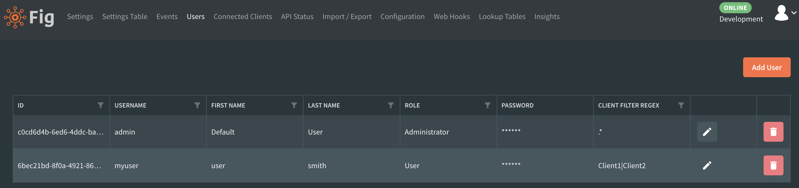
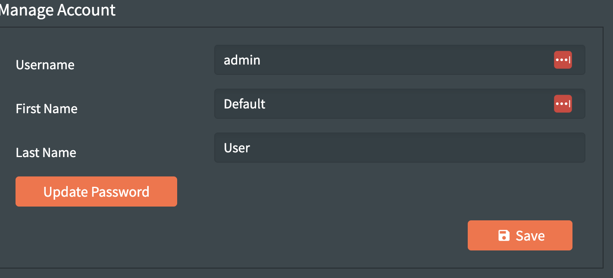

# User Management

Administrators in the Fig web client have the ability to manage users. They are able to create and delete users (or other administrators) as well as set and reset passwords.

  
*Administrators can create, modify and delete the users who have access to Fig*

## Client Filter Regex

It is possible to specify a regex to filter the clients available for a user. Logged in users will only see clients that match the specified filter. Any attempt to query or update clients that do not match the filter will result in an unauthorized from the server.

Administrators can also have filter regexes but as they are able to manage users, they'll be able to update their own.

## Allowed Classifications

Administrators can set the allowed classifications for each user. For more details, see [Classifications](./settings-management/3-classifications.md)

## Enforcing a Password Change

Administrators can require another user to change their password the next time they log in by selecting **enforce password change on next login** on the Users page.

- The requirement is applied on the user's next login, not immediately to an already active session.
- Once the user logs in with that flag set, Fig limits them to the password-change flow until they save a new password.
- If an administrator enters a new password for another user, the checkbox defaults to enabled so the user is prompted to choose their own password at the next login.

Administrators cannot set this flag for themselves from the Users page. Self-service password changes continue through the account management screen.

## Managing your own Account

All users can change their own password using the avatar image in the top right corner.

Wherever Fig asks for a new password, it now shows richer [zxcvbn](https://github.com/dropbox/zxcvbn) feedback including strength guidance, comments, and suggestions to help users choose stronger passwords.

*Users are able to manage their own accounts*
