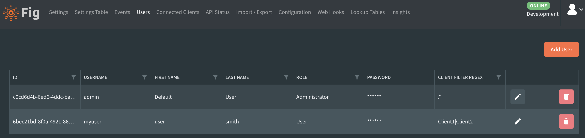
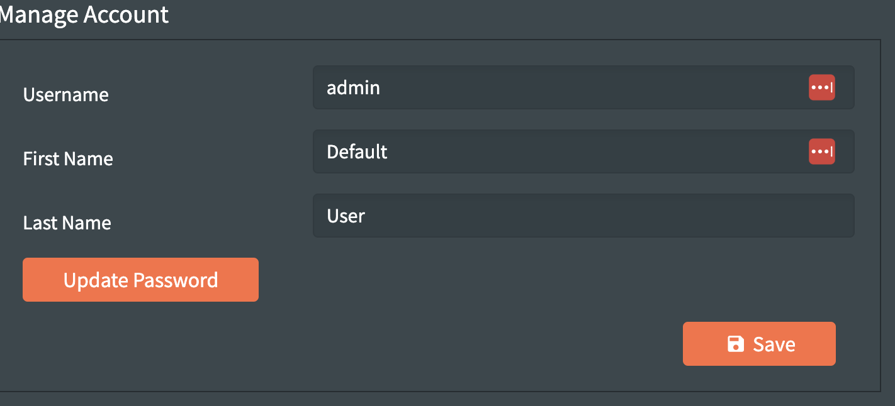

# User Management

Administrators in the Fig web client have the ability to manage users. They are able to create and delete users (or other administrators) as well as set and reset passwords.

  
*Administrators can create, modify and delete the users who have access to Fig*

## Client Filter Regex

It is possible to specify a regex to filter the clients available for a user. Logged in users will only see clients that match the specified filter. Any attempt to query or update clients that do not match the filter will result in an unauthorized from the server.

Administrators can also have filter regexes but as they are able to manage users, they'll be able to update their own.

## Allowed Classifications

Administrators can set the allowed classifications for each user. For more details, see [Classifications](./settings-management/3-classifications.md)

## Managing your own Account

All users can change their own password using the avatar image in the top right corner.

*Users are able to manage their own accounts*

## Keycloak Mode

When Fig is configured to use Keycloak authentication mode, user identities are managed externally and Fig user management is disabled.

- `POST /users/authenticate` is unavailable.
- User-management endpoints (`/users`, `/users/register`, `/users/{id}`) are unavailable.
- In the web UI, user-management actions are suppressed in Keycloak mode.

For full setup details, claim mapping requirements, and mode troubleshooting, see [Security Features](../security.md#keycloak-authentication-mode).
