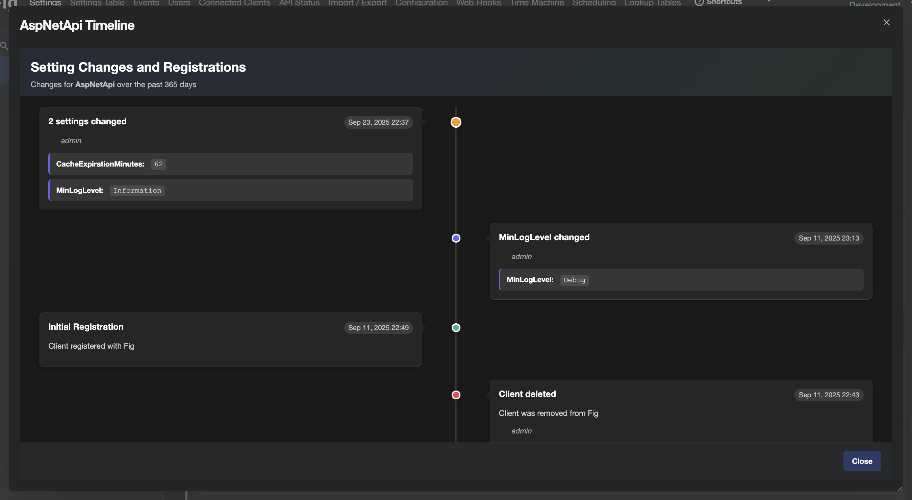

# Client Timeline

The Client Timeline feature provides a chronological view of all setting changes and registration events for a specific client over the past 60 days (by default, the period is configurable). This feature helps administrators and users track configuration changes, understand when settings were modified, and audit client changes.

## Overview

The timeline displays events in a vertical format with the most recent changes at the top. Events are automatically grouped by minute to consolidate multiple simultaneous changes and provide a cleaner view when many settings are updated together.

## Accessing the Timeline

The timeline can be accessed from the Settings page by:

1. Selecting a single client from the client list
2. Clicking the yellow timeline button located to the left of the Save button in the toolbar
3. The timeline dialog will open showing the last 30 days of activity for the selected client

**Note**: The timeline button is only enabled when a single client is selected. It is disabled when no client is selected or when multiple clients are selected.

  
*Timeline for a client*

## What the Timeline Shows

### Event Types

The timeline displays the following types of events:

- **Setting Value Changes**: When individual settings are updated
- **Initial Registration**: When a client first registers with Fig
- **Registration Updates**: When a client re-registers with modified settings definitions
- **Externally Managed Updates**: When externally managed settings are updated through the UI

### Event Grouping

Events that occur within the same minute are automatically grouped together:

- **Single Change**: Shows the setting name and new value
- **Multiple Changes**: Shows "X settings changed" with a tooltip containing details of all changes
- **Registration Events**: Shows the registration type and client information

## Configuration

The time period for the timeline can be configured in the Fig configuration page within the web application.
