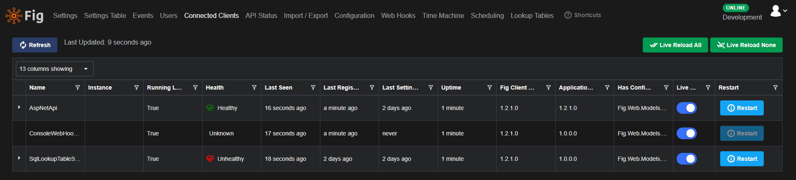

# Connected Clients

Administrators in Fig are able to see a list of all currently connected clients. Clients are considered connected if they poll the API at least once every 2 times the configured poll interval for that client. Clients will poll automatically as part of the `Fig.Client` nuget package and default to 30 seconds per poll.

The poll interval can be overridden using an environment variable `FIG_POLL_INTERVAL_MS` or by using the global override in the Fig configuration page.

The client management page also includes a number of other details about the client including the version of the `Fig.Client` nuget package and the version of the host application.

By default, Fig reads the assembly version of the application but this can be changed to the file or product version in the options. See [Fig Options](../client-configuration.md#fig-options) for details.

  
*Connected clients details are shown in an interactive list*

## Restart

If a setting is updated on a client that is not marked as supporting live reload, Fig will automatically change the restart button to 'Restart Required' and show it in red. This indicates that although fig as passed down all the setting updates, the application has been written in such a way that it is unable to dynamically load the updated setting value and the only way to apply the updated setting value is to restart the client. The client can be restarted by clicking the restart required button.

## Health

Fig will automatically check the health of all connected clients and report it back to the API. For details, see [Health Checks](./18-health-checks.md).

## Live Reload

By default, all clients are set to live reload. This means when a setting is changed in the web client, it will automatically be offered to the client on their next poll. However this can be disabled on a client by client basis. This allows setting changes to be rolled out to select clients and tested prior to a broader roll out. As soon as live reload is enabled again, the setting update will be offered on the next poll cycle.
