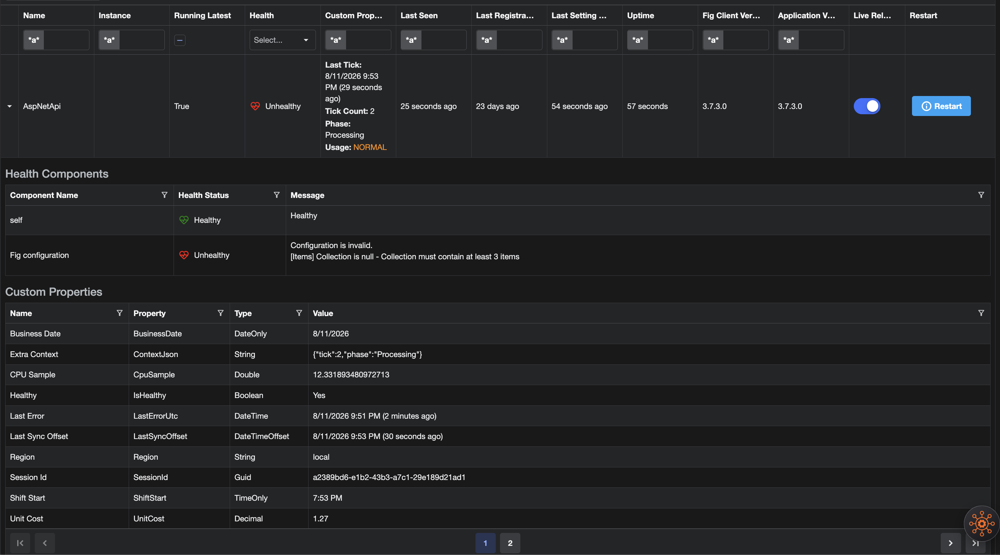

# Custom Status Properties

Fig clients can send developer-defined operational properties with each status poll. Values are stored on the run session, shown on the Connected Clients page, and available via lightweight REST endpoints for integrations.

Unlike settings, these properties are not configuration — they are live status the application reports while running (timestamps, queue depth, region, latency, and similar scalars).

## Defining properties

Define a class or record with the scalar properties you want to report:

```csharp
using Fig.Client.Abstractions.StatusProperties;

public class OrderProcessorStatus
{
    [StatusProperty(DisplayName = "Last Sync", Highlight = true, Order = 1)]
    public DateTime? LastSuccessfulSyncUtc { get; set; }

    [StatusProperty(DisplayName = "Queue", Highlight = true, Order = 2)]
    public long QueueDepth { get; set; }

    [StatusProperty(DisplayName = "Usage", Highlight = true, Order = 3)]
    public string Usage { get; set; } = "NORMAL";

    [StatusProperty(DisplayName = "Avg latency")]
    public TimeSpan? AverageLatency { get; set; }

    public string Region { get; set; } = "unknown";

    [StatusProperty(ShowInUi = false)]
    public string? InternalCorrelationId { get; set; }
}
```

Register once with DI (typically next to your Fig setup):

```csharp
builder.Services.AddFigStatusProperties<OrderProcessorStatus>();
builder.Host.UseFig<Settings>();
```

Update properties from your application code. Updating one property does not clear others; the full bag is sent on every poll:

```csharp
public class SyncService(IFigStatusProperties<OrderProcessorStatus> status)
{
    public void OnSyncOk(long depth)
    {
        status.Set(x => x.LastSuccessfulSyncUtc, DateTime.UtcNow);
        status.Set(x => x.QueueDepth, depth);
        // or: status.Update(x => { x.Usage = "NORMAL"; x.QueueDepth = depth; });
    }

    public void OnUsageChanged(string level)
    {
        // Optional hex TextColor (#RGB or #RRGGBB) colours the value in Fig.Web.
        // Omitting textColor leaves any previous colour unchanged.
        // Clear colour with: status.SetTextColor(x => x.Usage, null);
        var color = level switch
        {
            "HIGH" => "#E53935",
            "LOW" => "#43A047",
            _ => "#FB8C00"
        };
        status.Set(x => x.Usage, level, color);
    }
}
```

## `[StatusProperty]` options

| Option | Default | Purpose |
|--------|---------|---------|
| `DisplayName` | property name | Label in the UI |
| `Highlight` | `false` | Show in the collapsed Connected Clients column |
| `ShowInUi` | `true` | When `false`, omit from Fig.Web (still available via REST/MCP) |
| `Order` | `0` | Sort order in the UI |

Highlight only a few properties so the collapsed column stays scannable. All highlighted properties are shown (there is no hard “first 3” cut).

## Runtime text colour

`TextColor` is **not** set via the attribute. Pass it when updating a value:

- `Set(property, value, textColor)` — sets the value; when `textColor` is non-null it updates the colour; when omitted/`null`, the previous colour is left unchanged
- `SetTextColor(property, textColor)` — set or clear colour without changing the value (`null` clears)
- `Clear(property)` — resets the value **and** clears its colour

Valid colours are `#RGB` or `#RRGGBB` (case-insensitive). Fig.Web applies the colour to the **value** text only (labels stay bold/default).

## Supported types

Scalars only (including nullable equivalents):

- `string` (also an escape hatch for ad-hoc JSON text if needed)
- `bool`
- integer widths, `long` / `ulong` (values must fit in `long`)
- `float` / `double`
- `decimal` (sent as a string for precision)
- `DateTime`, `DateTimeOffset`, `DateOnly`, `TimeOnly`
- `TimeSpan`
- `Guid`
- enums (sent as the enum name)

Complex types, arrays, and dictionaries are skipped. Prefer a `string` property if you need a free-form blob.

## Limits

To prevent abuse, Fig enforces:

- max **25** properties
- max **2048** characters per string value
- max **64** characters per property name
- max **4 KB** serialized JSON

Oversized payloads are rejected by the API (`400`). The client omits an oversized snapshot from a poll and logs a warning rather than failing the poll loop.

## Viewing in Fig.Web

  
*Custom properties are displayed both as a column in the table and in the expanded section*

On **Connected Clients**:

- The **Custom Properties** column shows highlighted (`Highlight = true`) properties, one per line, with bold labels.
- Optional `TextColor` hex values colour the **value** text (not the label).
- Expanding a row lists all `ShowInUi` properties with type-aware formatting (and the same text colour on values).
- Properties with `ShowInUi = false` are never shown in the UI or CSV export.

## REST API

Custom properties are included on each run session from `GET /statuses`.

Lightweight endpoints (Admin / User / ReadOnly) return only identity + properties:

| Endpoint | Description |
|----------|-------------|
| `GET /statuses/properties` | All non-expired sessions |
| `GET /statuses/{clientName}/properties?instance=` | Filter by client (and optional instance) |

These always return the full property bag, including API-only (`ShowInUi = false`) properties.
