# Dashboards

Dashboards are configurable, read-only views of Fig status and settings data. Use them for wallboards, operations boards, and fleet health summaries.

Each dashboard is a **12-column grid** of trusted Fig UI components. Data for each component comes from a short **inline JavaScript** script that runs in the browser (via Jint). Scripts transform live Fig data (`fig.clients` and `fig.runSessions`) into the shape each component expects. Users cannot inject HTML or Razor—only data transformations.

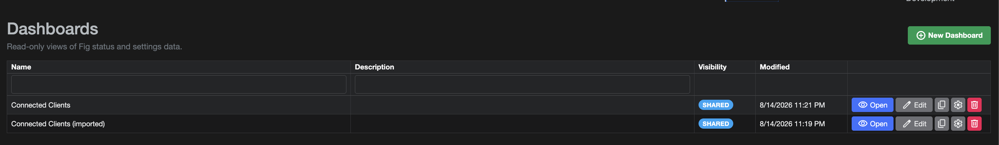

## Who can use dashboards

| Action | Roles |
|--------|--------|
| View dashboards | Administrator, User, ReadOnly, **Dashboard** |
| Create, edit, delete, duplicate | **Administrator** only |

- Dashboards marked **Admin only** are hidden from non-administrators.
- Users with the **Dashboard** role are redirected to `/dashboards` after login and only see the dashboards UI (not settings management).
- See [User Management](./3-user-management.md) for roles.

## Getting started

1. Open **Dashboards** from the main navigation (`/dashboards`).
2. Click **New Dashboard** (administrators).
3. Open **Properties** (gear icon) to set:
   - **Name** and **Description**
   - **Admin only** visibility
   - **Refresh** intervals (status and settings—see [Refresh](#refresh))
4. Click **Edit** to open the canvas editor.
5. Add components from the left palette, place them on the grid, and bind data with suggested or custom scripts.
6. **Save**, then **Open** (view) or enable **Wallboard** mode.

## Editor

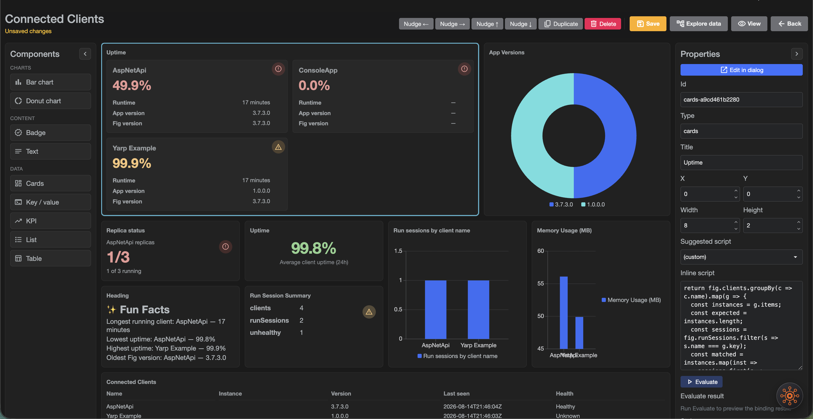

### Layout

| Area | Purpose |
|------|---------|
| Left palette | Component types (KPI, Text, Badge, charts, Table, List, Key/value, Cards). Panels collapse to free canvas space. |
| Center canvas | 12-column grid. Click a blank area to deselect. |
| Right properties | Selected component fields, suggested script, inline script, Evaluate. Collapse to free space. |
| Top toolbar | Save, View, Data explorer, nudge / duplicate / delete for the selection. |

### Placing and editing components

- Click a palette item to add it; drag or use **arrow keys** / nudge buttons to move the selection.
- Double-click a component (or use **Edit** in the sidebar) to open the **component edit dialog**: all properties, a live preview, and a **Monaco** JavaScript editor with IntelliSense for `fig`.
- Changes in the dialog sync back to the sidebar when you close it.
- Scripts are evaluated when you press **Evaluate** or leave the script field—not on every keystroke.

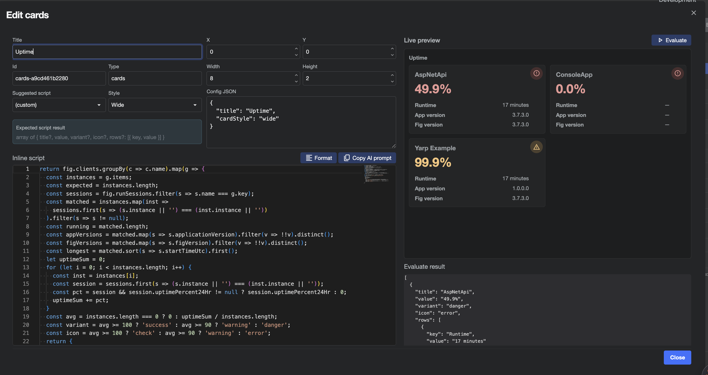

### Data explorer

Use **Data explorer** (toolbar) to browse the live `fig` object tree. Each node has a **copy** control that copies the full JavaScript path (for example `fig.runSessions[0].applicationVersion`) so you can paste it into a script.

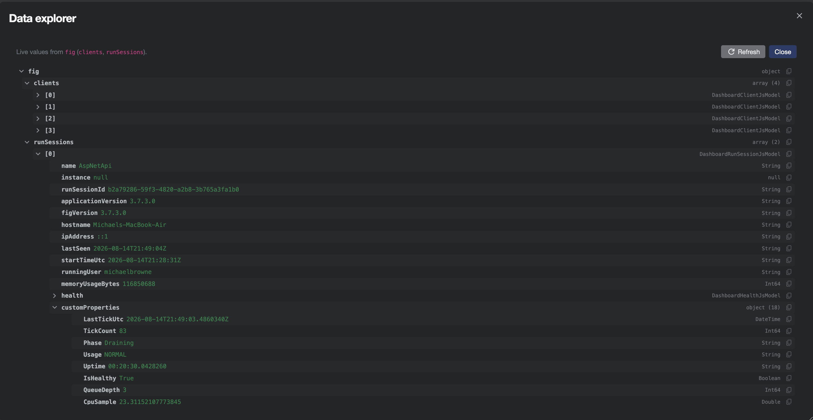

### Fig Assistant and external AI

- With [Fig Assistant](./39-fig-assistant.md) configured, you can ask it to write or update the **selected** component’s inline script (dashboard-scoped actions only).
- Without Assistant, open the component edit dialog and use **Copy AI prompt**. Paste the prompt into any external AI, describe what you want the visualization to show, and paste the returned JavaScript (prefer a fenced `javascript` code block) into Monaco. Use **Format** to beautify the script.

## Viewer and wallboard

On the view page (`/dashboards/{id}`):

- **Refresh status** / **Refresh settings** — force-reload cached data used by scripts.
- **Export HTML** — download a static HTML snapshot (charts rendered with Chart.js). Secrets and live polling are not included.
- **Wallboard** — hides Fig chrome for a kiosk-friendly layout (`?wallboard=1`). Click **Wallboard** / **Exit wallboard** again, or press **Esc**, to leave wallboard mode.
- **Edit** — administrators return to the canvas.

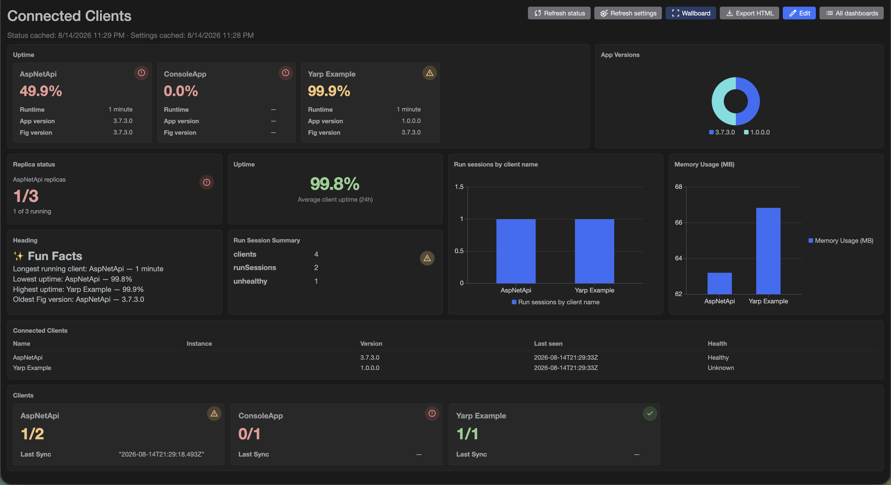

## Data model (`fig`)

Scripts receive a root object `fig` with two collections. Both are **fluent arrays** (not native JavaScript `Array`): they support indexing and helpers such as `filter`, `map`, `groupBy`, `count`, `sum`, `first`, `last`, `sort`, `take`, `distinct`, `toArray`. Prefer `.length` and `.count(...)` for counts—do not assume a CLR `Count` property.

### `fig.runSessions`

One entry per connected run session (see also [Connected Clients](./4-connected-clients.md)).

| Property | Type | Notes |
|----------|------|--------|
| `name` | string | Client name |
| `instance` | string? | Instance name when used |
| `runSessionId` | string | Session id |
| `applicationVersion` | string? | Host app version |
| `figVersion` | string? | Fig.Client package version |
| `hostname` | string? | |
| `ipAddress` | string? | |
| `lastSeen` | string? | |
| `startTimeUtc` | string | |
| `runningUser` | string | |
| `memoryUsageBytes` | number | |
| `health` | object | `{ status, components[] }` — see [Health Checks](./18-health-checks.md) |
| `customProperties` | object | Keys from [Custom Status Properties](./40-custom-status-properties.md) |
| `uptimePercent24Hr` | number? | Approximate rolling 24h client uptime (0–100); also shown as a hidden column on Connected Clients |
| `uptimeHuman` | string | Humanized process runtime (for example `"3 hours"`) |

### `fig.clients`

Registered clients and non-secret setting values available to the current user (classification-filtered).

| Property | Type | Notes |
|----------|------|--------|
| `name` | string | |
| `instance` | string? | |
| `description` | string | |
| `settings` | object | Setting name → value |

:::tip
Use **Data explorer** to see live keys under `settings` and `customProperties` for your environment. Monaco and the AI prompt also include dynamic typings for those keys when data is loaded.
:::

### Example helpers

```javascript
// Sessions for one client
const sessions = fig.runSessions.filter(s => s.name === 'AspNetApi');

// Group and chart
return fig.runSessions
  .groupBy(s => s.health.status)
  .map(g => ({ label: g.key, value: g.items.length }));
```

## Component reference

Every component is bound with an **inline script** that must `return` (or evaluate to) the expected shape. Use the **Suggested script** dropdown to load a working starter, then customize.

Shared visual variants where noted: `normal` | `info` | `success` | `warning` | `danger` (and `muted` for badges). Icons are Material icon names used by Radzen (for example `check`, `warning`, `error`).

### KPI

Large metric with optional label, subtitle, trend, coloured value, and status icon. Supports a single `value` or a `numerator` / `denominator` pair (displayed as `2/3`).

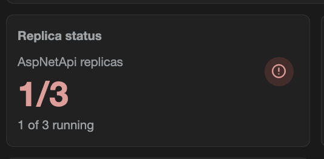

**Expected return**

```javascript
{
  value?: any,
  numerator?: number | string,
  denominator?: number | string,
  label?: string,
  subtitle?: string,
  trend?: string | number,
  variant?: 'normal' | 'info' | 'success' | 'warning' | 'danger',
  icon?: string
}
// or a primitive value
```

**Suggested scripts**

- Count run sessions  
- Replica count status  

```javascript
return { value: fig.runSessions.length, label: 'Connected run sessions' };
```

```javascript
const clientName = 'AspNetApi';
const expected = 3;
const warningAt = 2;
const sessions = fig.runSessions.filter(s => s.name === clientName);
const running = sessions.length;
const variant = running >= expected ? 'success' : running >= warningAt ? 'warning' : 'danger';
const icon = running >= expected ? 'check' : running >= warningAt ? 'warning' : 'error';
return {
  numerator: running,
  denominator: expected,
  label: clientName + ' replicas',
  subtitle: running + ' of ' + expected + ' running',
  variant: variant,
  icon: icon
};
```

### Text

One or more lines with independent size, colour, alignment, and weight—useful for large uptime percentages with a caption.

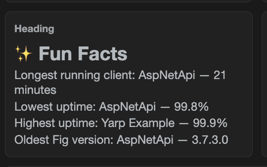

**Expected return**

```javascript
{
  lines: [
    {
      text: string,
      size?: 'xs' | 'sm' | 'md' | 'lg' | 'xl' | 'xxl',
      color?: string,   // any CSS color
      align?: 'left' | 'center' | 'right',
      weight?: 'normal' | 'bold'
    }
  ]
}
```

**Suggested scripts**: Client count summary, Run sessions heading, Average uptime (24h).

```javascript
const seen = {};
let sum = 0, count = 0;
for (let i = 0; i < fig.runSessions.length; i++) {
  const s = fig.runSessions[i];
  const key = s.name + '|' + (s.instance || '');
  if (seen[key]) continue;
  seen[key] = true;
  sum += (s.uptimePercent24Hr == null ? 0 : s.uptimePercent24Hr);
  count++;
}
const pct = count === 0 ? 0 : sum / count;
const color = pct >= 99 ? '#8fd18f' : (pct >= 95 ? '#f5c57a' : '#e89996');
return {
  lines: [
    { text: pct.toFixed(1) + '%', size: 'xxl', color: color, align: 'center', weight: 'bold' },
    { text: 'Average client uptime (24h)', size: 'sm', color: '#9aa0a6', align: 'center' }
  ]
};
```

### Badge

Compact status pill.

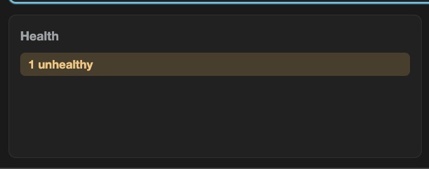

**Expected return**: string, or `{ text, variant? }` where `variant` is `info` | `success` | `warning` | `danger` | `muted`.

```javascript
const unhealthy = fig.runSessions.filter(s => s.health.status !== 'Healthy').length;
return {
  text: unhealthy === 0 ? 'All healthy' : unhealthy + ' unhealthy',
  variant: unhealthy === 0 ? 'success' : 'warning'
};
```

### Bar chart

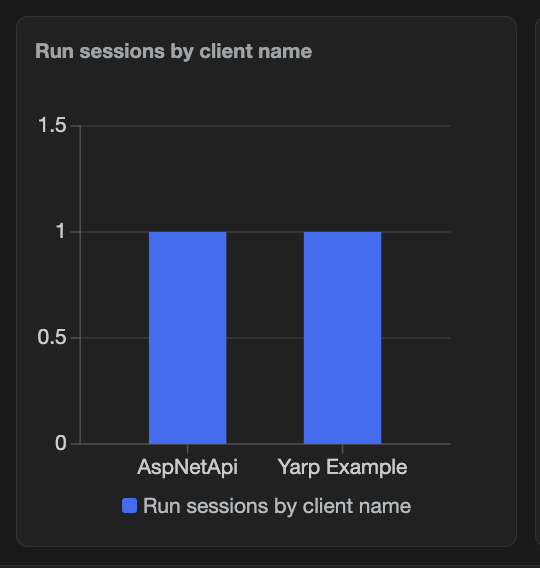

**Expected return**: `[{ label, value }, ...]`.

**Config**: **Legend** — `right` | `bottom` | `hidden`.

```javascript
return fig.runSessions
  .groupBy(s => s.applicationVersion)
  .map(g => ({ label: g.key, value: g.items.length }));
```

### Donut chart

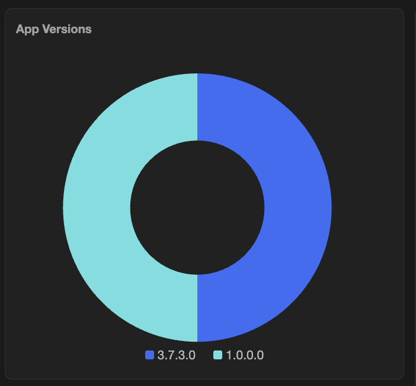

**Expected return**: same as bar chart — `[{ label, value }, ...]`.

**Config**:

| Option | Values | Default |
|--------|--------|---------|
| Legend | `right`, `bottom`, `hidden` | `right` |
| Chart size | `large`, `small` | `large` |

Use **small** when the donut sits beside dense cards so the grid row height stays compact.

```javascript
return fig.runSessions
  .groupBy(s => s.health.status)
  .map(g => ({ label: g.key, value: g.items.length }));
```

### Table

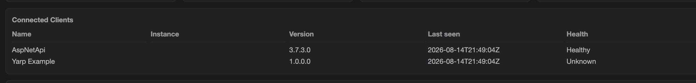

**Expected return**: array of row objects.

**Config**: `columns` in component config JSON (or via the table suggested script), for example:

```json
{
  "columns": [
    { "property": "name", "header": "Name" },
    { "property": "hostname", "header": "Hostname" },
    { "property": "health", "header": "Health" }
  ]
}
```

If columns are omitted, keys are inferred from the first row.

```javascript
return fig.runSessions.map(s => ({
  name: s.name,
  instance: s.instance,
  applicationVersion: s.applicationVersion,
  hostname: s.hostname,
  lastSeen: s.lastSeen,
  health: s.health && s.health.status
}));
```

### List

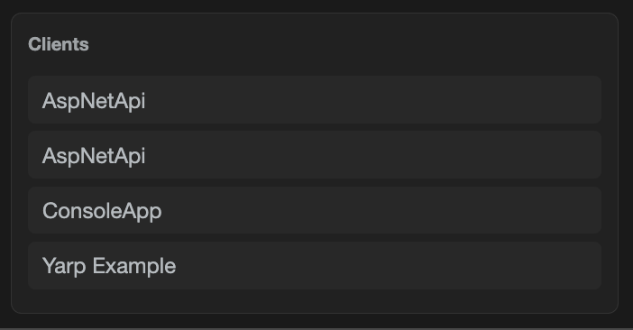

**Expected return**: string array, or `[{ text|name, secondary?, variant? }]`.

```javascript
return fig.runSessions.map(s => ({
  text: s.name,
  secondary: s.hostname || s.instance || ''
}));
```

### Key / value

Bold keys with values; optional status circle (icon + colour) in the top-right. Icon and colour can be set from the script so they change with data.

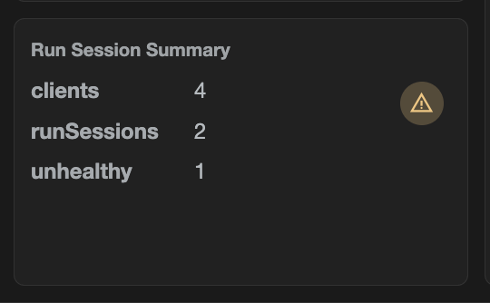

**Expected return**

```javascript
{
  statusIcon?: string,
  statusColor?: string,  // CSS color
  items: [{ key, value }, ...]
}
// or [{ key, value }, ...]
// or a plain object (each property becomes a pair; statusIcon/statusColor reserved)
```

```javascript
const unhealthy = fig.runSessions.filter(s => s.health.status !== 'Healthy').length;
return {
  statusIcon: unhealthy > 0 ? 'warning' : 'check',
  statusColor: unhealthy > 0 ? '#f5c57a' : '#8fd18f',
  items: [
    { key: 'clients', value: fig.clients.length },
    { key: 'runSessions', value: fig.runSessions.length },
    { key: 'unhealthy', value: unhealthy }
  ]
};
```

### Cards

Responsive grid of compact status cards (title, large value, optional icon, optional key/value rows). Colour applies to the value and icon, not a full-card fill.

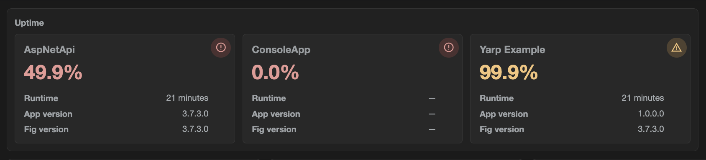

**Expected return**

```javascript
[
  {
    title?: string,
    value: any,
    variant?: 'normal' | 'info' | 'success' | 'warning' | 'danger',
    icon?: string,
    rows?: [{ key, value }]
  },
  ...
]
```

**Config — Card style**: `compact` (default) | `wide` | `extraWide` (wider cells for long values such as timestamps).

**Suggested scripts**: All clients overview, All clients uptime.

```javascript
// All clients overview (running/expected + detail rows)
return fig.clients.groupBy(c => c.name).map(g => {
  const instances = g.items;
  const expected = instances.length;
  const sessions = fig.runSessions.filter(s => s.name === g.key);
  const matched = instances.map(inst =>
    sessions.first(s => (s.instance || '') === (inst.instance || ''))
  ).filter(s => s != null);
  const running = matched.length;
  const appVersions = matched.map(s => s.applicationVersion).filter(v => !!v).distinct();
  const figVersions = matched.map(s => s.figVersion).filter(v => !!v).distinct();
  const longest = matched.sort(s => s.startTimeUtc).first();
  let uptimeSum = 0;
  for (let i = 0; i < matched.length; i++) {
    const pct = matched[i].uptimePercent24Hr;
    uptimeSum += (pct == null ? 0 : pct);
  }
  const variant = running >= expected ? 'success' : running > 0 ? 'warning' : 'danger';
  return {
    title: g.key,
    value: running + '/' + expected,
    variant: variant,
    icon: running >= expected ? 'check' : running > 0 ? 'warning' : 'error',
    rows: [
      { key: 'App version', value: appVersions.length === 0 ? '—' : appVersions.length === 1 ? appVersions[0] : 'Multiple' },
      { key: 'Runtime', value: longest && longest.uptimeHuman ? longest.uptimeHuman : '—' },
      { key: 'Fig version', value: figVersions.length === 0 ? '—' : figVersions.length === 1 ? figVersions[0] : 'Multiple' },
      { key: 'Uptime %', value: matched.length === 0 ? '—' : (uptimeSum / matched.length).toFixed(1) + '%' }
    ]
  };
});
```

## Scripting workflow

1. Select a component and choose a **Suggested script** (or write your own).
2. Open the **edit dialog** for Monaco IntelliSense (`fig.` completions, expected return type).
3. Click **Evaluate** to run the script and refresh the preview / canvas result.
4. Use **Data explorer** to confirm property names and copy paths.
5. Optionally **Copy AI prompt**, get a script from an external model, paste it in, then **Format**.
6. **Save** the dashboard.

:::note
Scripts must return the shape the component expects. For example, a key/value component that returns `{ name, instance }` without `key`/`value` pairs or `items` will render empty even if Evaluate shows JSON.
:::

## Refresh

Configured under dashboard **Properties**:

| Setting | Default | Meaning |
|---------|---------|---------|
| Status seconds | `60` | How often run-session / status data is refreshed while the dashboard is open |
| Settings seconds | `600` | How often client settings data is refreshed |

Manual **Refresh status** / **Refresh settings** on the view page bypass the timers. Data explorer **Refresh** reloads both.

## Import and export

On the **Import / Export** page:

- **Dashboard Export** — downloads all dashboard definitions as JSON (no live data or secrets).
- **Dashboard Import** — creates **new** dashboards only (never overwrites). Name collisions are renamed with ` (imported)`.

You can also **Export HTML** from an individual dashboard’s view page for a static shareable snapshot.

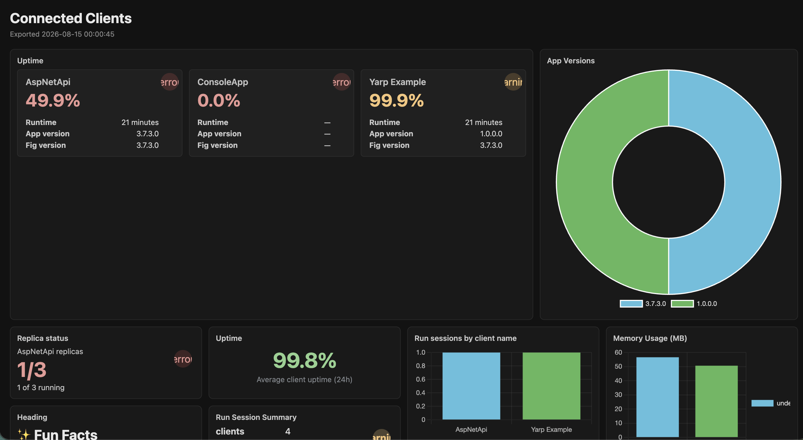