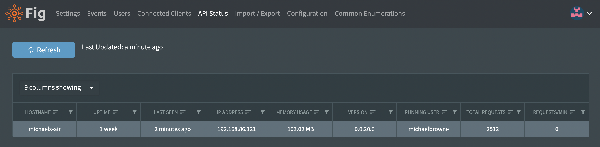

# API Management

The Fig API is stateless and as a result, it is possible to run multiple instances of the API pointing towards the same database.

All API instances must have the same server secret as this is used for encryption in the database and token generation.

The API Status page shows the API's that are currently running in the system along with a number of details relating to that API.

  
*API Status shows details for the running API's*
