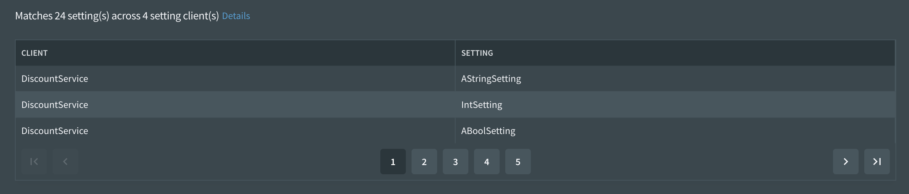

# Web Hooks

Fig has a web hook integration point which allows third party integrations to be called by Fig in response to certain events occurring. This allows events from Fig to be available more widely for example sent to someone via email or posted to a Slack or Teams channel.

## Web Hook Types

Web Hooks are currently support for the following events:

| Event                       | Description                                                  | Contract                                                     | Route (POST)               |
| --------------------------- | ------------------------------------------------------------ | ------------------------------------------------------------ | -------------------------- |
| Client Status Changed       | When a setting client connects or is marked as disconnected this web hook will be called. Note that clients may be marked as disconnected some time after they are actually no longer running as the check is performed on the next poll for an instance of that client. The contract indicates if the the client is connecting or disconnected. | [Github](https://github.com/mzbrau/fig/blob/main/src/common/Fig.WebHooks.Contracts/ClientStatusChangedDataContract.cs) | /ClientStatusChanged       |
| Setting Value Changed       | When a setting value is updated and it matches the provided filters, this web hook will be sent. One web hook is sent per setting client that has the value changed. | [Github](https://github.com/mzbrau/fig/blob/main/src/common/Fig.WebHooks.Contracts/SettingValueChangedDataContract.cs) | /SettingValueChanged       |
| New Client Registration     | When a new client is registered with Fig this web hook will be sent. | [Github](https://github.com/mzbrau/fig/blob/main/src/common/Fig.WebHooks.Contracts/ClientRegistrationDataContract.cs) | /NewClientRegistration     |
| Updated Client Registration | When a client already known to Fig registers (the integration starts) and includes an updated setting definition this web hook is sent. This is not triggered by an unchanged registration. | [Github](https://github.com/mzbrau/fig/blob/main/src/common/Fig.WebHooks.Contracts/ClientRegistrationDataContract.cs) | /UpdatedClientRegistration |
| Minimum Run Sessions        | Fig is able to track the number of running sessions for any client. A web hook can be configured to be sent when the number of running clients drops below a configured number. This web hook will also be sent when the minimum number is restored. Note that it is not possible to set a value of 1 for minimum run sessions. This is due to the way fig tracks the run sessions. Run sessions are considered disconnected if they have missed 2 consecutive polls. These checks are performed when another run session from the same client performs a poll. As a result, if there is only 1 run session and it disconnects, it will not be marked as disconnected (although it will be excluded when sent to the web app). | [Github](https://github.com/mzbrau/fig/blob/main/src/common/Fig.WebHooks.Contracts/MinRunSessionsDataContract.cs) | /MinRunSessions            |
| Health Status Changed       | Clients report their health back to Fig. When their health changes, this web hook is called and it includes details of their health including the health of sub-components. | [Github](https://github.com/mzbrau/fig/blob/main/src/common/Fig.WebHooks.Contracts/ClientHealthChangedDataContract.cs)                                               | /HealthStatusChanged       |

## Web Hook Configuration

Web Hooks can be configured by administrators using the Fig Web Application.

Configuration is performed in two parts:

### Web Hook Clients

Clients are web hook integrations. A client needs to be defined for each integration that should receive web hooks. A client does not need to handle all web hook types.

Click 'Add Client' to add a new client. The two required fields are 'Name' and 'Base Uri'. Name is only used to associate the client with web hook configurations below. The base URI should be the address of the web hook integration. For example:

Once entered, select the tick to save. Fig will generate a new secret to be used to secure the web hook integration. This information will be displayed in a popup. Be sure to copy this hashed secret value as it is only shown once (a new one can be generated if required). See the Web Hook Integration page for details of how this hashed secret can be used.

At this point, it is possible to test the client using the 'Test' button. All routes will be tested so if the integration does not support all routes there may be some errors shown.

### Configuring Web Hooks

Web hooks can be added using the 'Add Web Hook' button.

Select a configured client and the event that should be sent. Once an event has been selected, additional configuration items will be shown. These are as follows:

| Configuration Item   | Description                                                  | Example |
| -------------------- | ------------------------------------------------------------ | ------- |
| Setting Client Regex | A regular expression which can be used to filter the setting clients that will result in a web hook being sent. Web hooks will only be sent when there is a match. | .*      |
| Setting Name Regex   | A regular expression which will be used to filter the setting values that are changed. A web hook will only be sent if one of the updated settings matches the regular expression. | .*      |
| Minimum Running      | The minimum number of running instances of the setting client. If the number of running sessions falls below this number, a web hook will be sent. Note the minimum value is 2. | 2       |

Once the web hook has been configured and saved, fig will calculate the number of clients and settings that match given the configuration filters. More details of these matches can be shown by clicking the details link.

