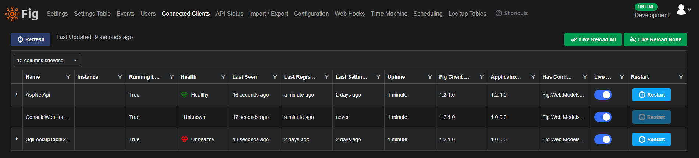

# Client Management

Administrators in Fig are able to see a list of all currently connected clients. Clients are considered connected if they poll the API at least once every 2 times the configured poll interval for that client. Clients will poll automatically as part of the `Fig.Client` nuget package and default to 30 seconds per poll.

The poll interval can be overridden using an environment variable `FIG_POLL_INTERVAL_MS` or by using the global override in the Fig configuration page.

The client management page also includes a number of other details about the client including the version of the `Fig.Client` nuget package and the version of the host application. 

By default, Fig reads the assembly version of the application but this can be changed to the file or product version if preferred. For example:

```csharp
var configuration = new ConfigurationBuilder()
    .AddFig<Settings>(o =>
    {
        o.ClientName = "AspNetApi";
        o.SupportsRestart = true;
        o.VersionType = VersionType.File;
    }).Build();
```

The version can also be overridden in the fig configuration. For example:

```csharp
var configuration = new ConfigurationBuilder()
    .AddFig<Settings>(o =>
    {
        o.ClientName = "AspNetApi";
        o.SupportsRestart = true;
        o.VersionOverride = "v6";
    }).Build();
```

It is possible to restart clients if the restart requested event is subscribed to. To add this functionally, add the following in your `program.cs` file:

```csharp
builder.Host.UseFigRestart<Settings>();
```

## Appearance



If a setting is updated on a client that is not marked as supporting live reload, Fig will automatically change the restart button to 'Restart Required' and show it in red. This indicates that although fig as passed down all the setting updates, the application has been written in such a way that it is unable to dynamically load the updated setting value and the only way to apply the updated setting value is to restart the client. The client can be restarted by clicking the restart required button.

