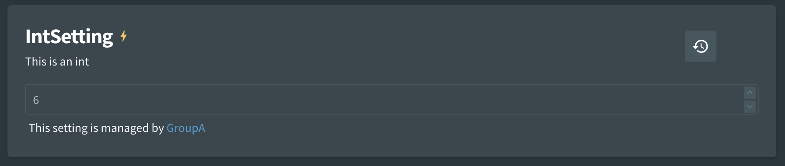
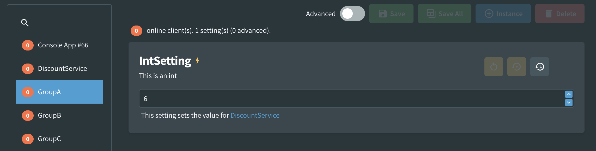
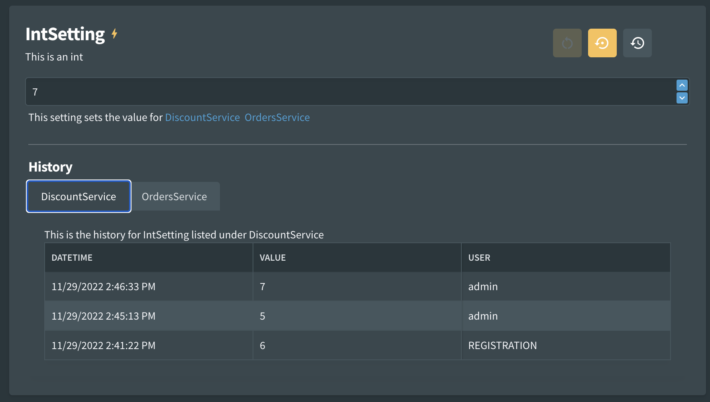

# Groups

Fig has the capability to group settings from multiple setting clients so they can be edited in one place. This is useful when multiple applications require the same configuration such as a database connection string. With the groups feature this can be set once and applied to all requesting clients simultaneously.

## Usage

```csharp
[Group("GroupA")]
[Setting("This is an int", 6)]
public int IntSetting { get; set; }
```

## Appearance

Grouped settings are visible under each individual setting client but they are not editable there. Instead they direct user to the group where they can be updated in a single location.



If the group is selected, it also indicates which setting clients are using the setting.



Settings can only be in a single group at a time but there is no limits to the number of settings that can be in a group or the number of clients using the same group.

When viewing the history within a group, each service has its own individual history shown in different tabs.



## Ungrouping

There may be cases where settings have been grouped but need to be set individually to a different value from the group value. In this case, an instance can be created for that setting client. Instances are not grouped.

See Instances for more information.

## Overriding via Environment Variable

The group value can be overridden using an environment variable. It should be in the format `FIG_SettingName_GROUP`

Use a value of 'null' to clear the current value.

For example, if a setting Username was in a group "Auth" but you wanted to un-group it. You could do so by setting an environment variable `FIG_USERNAME_GROUP=null`
