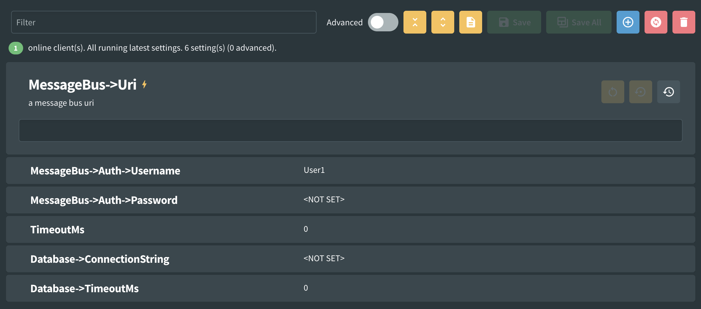

# Nested Settings

:::info[Note]

This feature was introduced in Fig v0.11.

:::

Application settings are often best modeled as a number of nested classes, this provides a number of advantages including:

- Settings can be locally grouped with related settings
- Setting classes can be reused between multiple components

Fig supports this configuration with the concept of Nested Settings. 

Settings are ordered in the same order they appear in the settings class.

## Usage

```csharp

public class ConsoleSettings : SettingsBase
{
    public override string ClientDescription => "Example of nested settings";

    [NestedSetting]
    public MessageBus? MessageBus { get; set; }
    
    [Setting("a timeout in milliseconds")]
    public double TimeoutMs { get; set; }
    
    [NestedSetting]
    public Database Database { get; set; }

    public override void Validate(ILogger logger)
    {
        //Perform validation here.
        SetConfigurationErrorStatus(false);
    }
}

public class MessageBus
{
    [Setting("a message bus uri")]
    public string? Uri { get; set; }
    
    [NestedSetting]
    public Authorization? Auth { get; set; }
}

public class Authorization
{
    [Setting("a message bus user")]
    public string Username { get; set; } = "User1";
    
    [Setting("a message bus password")]
    public string? Password { get; set; }
}

public class Database
{
    [Setting("a database connection string")]
    public string? ConnectionString { get; set; }
    
    [Setting("a database timeout")]
    public int TimeoutMs { get; set; }
}

```

## Attribute Inheritance

Fig supports attribute inheritance for nested settings. When you apply certain attributes to a property marked with `[NestedSetting]`, those attributes are automatically inherited by all child properties within the nested class.

### Inheritable Attributes

The following attributes can be inherited from nested setting properties:

- `[Advanced]` - Child properties will be marked as advanced
- `[Category]` - Child properties will inherit the category name and color
- `[Group]` - Child properties will inherit the group name
- `[Indent]` - Child properties will inherit the indentation level
- `[EnvironmentSpecific]` - Child properties will be marked as environment-specific
- `[DependsOn]` - Child properties will inherit dependency relationships
- `[DisplayScript]` - Child properties will inherit JavaScript display scripts
- `[MultiLine]` - Child properties will inherit multi-line editor configuration
- `[LookupTable]` - Child properties will inherit lookup table references
- `[ValidValues]` - Child properties will inherit valid value constraints
- `[Secret]` - Child properties will be marked as secret/sensitive
- `[Validation]` - Child properties will inherit validation rules and regex patterns
- `[ValidateGreaterThan]` - Child properties will inherit greater-than validation constraints
- `[ValidateLessThan]` - Child properties will inherit less-than validation constraints
- `[ValidateIsBetween]` - Child properties will inherit range validation constraints
- `[ConfigurationSectionOverride]` - Child properties will inherit configuration section mappings

```csharp
public class Settings : SettingsBase
{
    public override string ClientDescription => "Settings with inherited attributes";

    [NestedSetting]
    [Advanced]
    [Category("Database Configuration", "#4f51c9")]
    public DatabaseSettings Database { get; set; } = new();

    public override void Validate(ILogger logger)
    {
        SetConfigurationErrorStatus(false);
    }
}

public class DatabaseSettings
{
    [Setting("Database connection string")]
    public string ConnectionString { get; set; } = "";
    
    [Setting("Query timeout in seconds")]
    public int TimeoutSeconds { get; set; } = 30;
}
```

In this example, both `ConnectionString` and `TimeoutSeconds` will:

- Be marked as advanced settings (inherited from `[Advanced]`)
- Be categorized under "Database Configuration" with the blue color (inherited from `[Category]`)

### Attribute Override

Child properties can override inherited attributes by applying their own attributes:

```csharp
public class DatabaseSettings
{
    [Setting("Database connection string")]
    [Category("Connection", "#ff0000")]  // Overrides inherited category
    public string ConnectionString { get; set; } = "";
    
    [Setting("Query timeout in seconds")]
    // This will use the inherited category from the parent
    public int TimeoutSeconds { get; set; } = 30;
}
```

### Multi-Level Inheritance

Attribute inheritance works with multiple levels of nesting:

```csharp
[NestedSetting]
[Advanced]
public Level1 Level1 { get; set; } = new();

public class Level1
{
    [NestedSetting]
    [Group("Security")]
    public Level2 Level2 { get; set; } = new();
}

public class Level2
{
    [Setting("API key")]
    public string ApiKey { get; set; } = "";
}
```

The `ApiKey` property will inherit both:

- `[Advanced]` from the top-level nested setting
- `[Group("Security")]` from the Level1 nested setting

## Appearance


