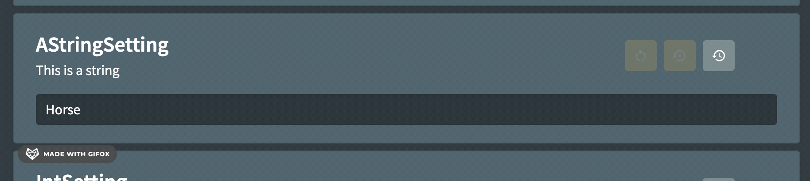

# Validation

String, integer or long type settings can have custom regular expression that will be used to validate the setting. If a value is entered that does not match the regex then a custom message will be shown to the person configuring the setting and saving will not be allowed.

## Usage

```csharp
[Setting("This is a string", "Horse")]
[Validation("[0-9a-zA-Z]{5,}", "Must have 5 or more characters")]
public string AStringSetting { get; set; } = null!;
```

It is also possible to use some built in regular expressions for common validation checks. For example:

```csharp
[Setting("This is a string", "Horse")]
[Validation(ValidationType.NotEmpty)]
public string AStringSetting { get; set; } = null!;
```

## Class-level Validation

You can also apply validation rules at the class level, which will automatically apply to properties of specified types, unless they already have their own validation attributes. This is useful when you want to enforce consistent validation rules across multiple properties of the same type.

You can exclude properties from validation using `[Validation(ValidationType.None)]`.

```csharp
// Apply validation to all string properties that don't have their own validation attribute
[ValidationOfAllTypes(@"[^\s]+", "Value cannot contain spaces", typeof(string))]
// Apply validation to all int properties that don't have their own validation attribute
[ValidationOfAllTypes(@"[1-9][0-9]*", "Must be a positive number", typeof(int))]
public class ApplicationSettings
{
    [Setting("Username")]
    // Will use class-level validation for strings: no spaces allowed
    public string Username { get; set; } = null!;
    
    [Setting("Password")]
    // Override class-level validation with property-specific validation
    [Validation(@"[a-zA-Z0-9]{8,}", "Password must be at least 8 alphanumeric characters")]
    public string Password { get; set; } = null!;
    
    [Setting("Age")]
    // Will use class-level validation for integers: must be positive
    public int Age { get; set; }
}
```

## Appearance



## Overriding via Environment Variable

The validation value can be overridden using an environment variable. It should be in the format `FIG_SettingName_VALIDATIONREGEX` and `FIG_SettingName_VALIDATIONEXPLANATION`

Use a value of 'null' to clear the current value.

## Excluding Validation from Health Checks

By default, all `[Validation]` attributes are also included in the [Fig Health Check](../18-health-checks.md). This means that if a setting does not pass validation, the application will be marked as unhealthy and potentially not sent any requests by the load balancer. If the validation is complex and there is a risk that a valid setting might be treated as invalid, you can exclude the validation from the health check.

For example:

```csharp
[Validation(ValidationType.NotEmpty, false)]
```

Alternatively, you can use a [Display Script](./8-display-scripts.md) instead as they are not run as part of a health check.

## Additional Validation Attributes

Sometimes validating values using regular expressions is difficult and a different approach is required. [Display Scripts](./8-display-scripts.md) can be used but require some effort to write.

There are some pre-built attributes that use display scripts behind the scenes but also add the benifit of client side validation in the health check. These are:

- `[ValidateIsBetween(3, 8)]` - Validates the number is between the two provided values. Use `Inclusion.Inclusive` (default) to include the boundary values or `Inclusion.Exclusive` to exclude them.
  - Example: `[ValidateIsBetween(3, 8, Inclusion.Exclusive)]` validates that the value is greater than 3 and less than 8.
- `[ValidateGreaterThan(5)]` - validates the number is greater than the provided value. Use `Inclusion.Exclusive` (default) for greater than or `Inclusion.Inclusive` for greater than or equal to.
  - Example: `[ValidateGreaterThan(5, Inclusion.Inclusive)]` validates that the value is greater than or equal to 5.
- `[ValidateLessThan(6)]` - validates the number is less than the provided value. Use `Inclusion.Exclusive` (default) for less than or `Inclusion.Inclusive` for less than or equal to.
  - Example: `[ValidateLessThan(6, Inclusion.Inclusive)]` validates that the value is less than or equal to 6.
- `[ValidateSqlServerConnectionString]` - validates the basic components of an SQL connection string.

### Inclusion Parameter

The validation attributes that compare numeric values (`ValidateIsBetween`, `ValidateGreaterThan`, and `ValidateLessThan`) use an `Inclusion` enum parameter to specify whether boundary values should be included in the validation:

- `Inclusion.Inclusive` - Includes the boundary value(s) in the valid range
- `Inclusion.Exclusive` - Excludes the boundary value(s) from the valid range

For example:

```csharp
[ValidateIsBetween(0, 100, Inclusion.Inclusive)]  // Valid range: 0 <= value <= 100
[ValidateIsBetween(0, 100, Inclusion.Exclusive)]  // Valid range: 0 < value < 100

[ValidateGreaterThan(10, Inclusion.Inclusive)]    // Valid range: value >= 10
[ValidateGreaterThan(10, Inclusion.Exclusive)]    // Valid range: value > 10

[ValidateLessThan(50, Inclusion.Inclusive)]       // Valid range: value <= 50  
[ValidateLessThan(50, Inclusion.Exclusive)]       // Valid range: value < 50
```

Note that all the new validation attributes rely on [Display Scripts](./8-display-scripts.md) to work in the web application. The display scripts needs to be enabled within the configuration.

:::note[Excluding from health check]

All of these validation operators have the option to explicitly exclude them from health checks. This could be useful in the case where a valid value might fail the validation due to complexities of the validation process or lack of understanding of the requirements.

:::

:::info[Suggestions]

If you have suggestions for other attributes that could perform validation that would be difficult with a regular expression, please raise a GitHub ticket.

:::
