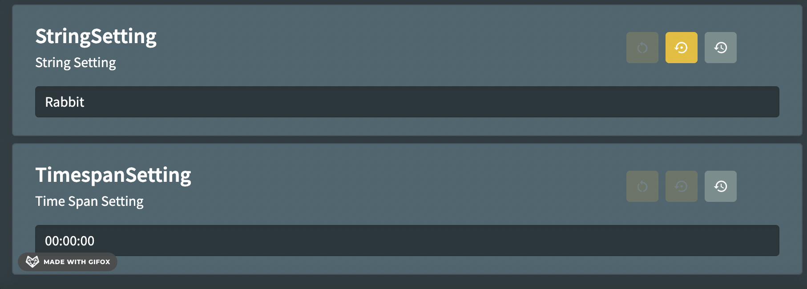

# Value History

Every value change that occurs in Fig is recorded in the database and is available from within the setting card.

When a setting is renamed with `MigrateFrom`, Fig moves the old setting's value history to the new setting name and adds a history entry that records when the rename happened and which value was carried over. This keeps one continuous history for the renamed setting even after the temporary `MigrateFrom` attribute is removed.

## Appearance

