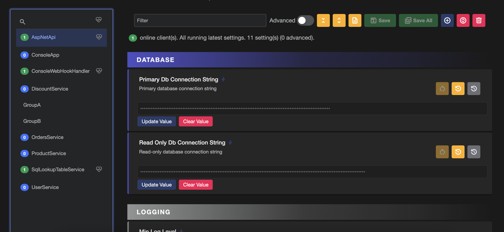
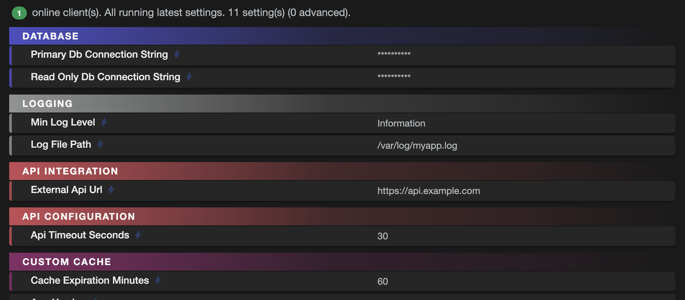

# Setting Headings

## Overview

Headings are visual separators that help organize settings into logical groups in the Fig web UI. They provide visual separation with customizable text labels, indentation, and colors to make settings easier to navigate and understand.

:::tip Automatic Headings (Recommended)
Fig automatically creates headings based on your `[Category]` attributes. This is the **recommended approach** as it requires no additional configuration and keeps your code clean. Manual heading attributes are only needed for special cases.
:::

  
*Headings shown above settings*

  
*Headings when settings are collapsed*

## Automatic Heading Creation

By default, Fig automatically generates headings based on the `[Category]` attribute on your settings. This is the easiest and most maintainable way to organize your settings.

### Basic Automatic Headings

```csharp
public class ApplicationSettings : SettingsBase
{
    [Category("Application Configuration")]
    [Setting("Application Name")]
    public string AppName { get; set; } = "MyApp";

    [Category("Application Configuration")]
    [Setting("Version")]
    public string Version { get; set; } = "1.0.0";

    [Category("Database Settings", "#0066CC")]
    [Setting("Connection String")]
    public string ConnectionString { get; set; } = "";

    [Category("Database Settings", "#0066CC")]
    [Setting("Timeout")]
    public int Timeout { get; set; } = 30;
}
```

This will automatically create:
- An "Application Configuration" heading above `AppName`
- A blue "Database Settings" heading above `ConnectionString`

### Controlling Automatic Headings

You can disable automatic heading generation in your `FigOptions`:

```csharp
services.Configure<FigOptions>(options =>
{
    options.AutomaticallyGenerateHeadings = false; // Disable automatic headings
});
```

:::warning
Only disable automatic headings if you need full manual control. In most cases, the automatic behavior is sufficient and easier to maintain.
:::

## Manual Heading Attribute (Advanced)

:::info When to Use Manual Headings
Manual headings should only be used when:
- You need headings that don't correspond to categories
- You need complex indentation hierarchies
- You have disabled automatic heading generation
- You need special headings
:::

The `HeadingAttribute` provides manual control over heading placement and appearance.

### Basic Manual Heading

```csharp
[Heading("Database Configuration")]
[Setting("Database Connection String")]
public string DatabaseConnectionString { get; set; } = "Server=localhost";

[Setting("Connection Timeout")]
public int ConnectionTimeout { get; set; } = 30;
```

### Manual Heading with Indentation

```csharp
[Heading("Authentication Settings", indent: 1)]
[Setting("Username")]
[Indent(1)]
public string Username { get; set; } = "";

[Heading("Advanced Authentication", indent: 2)]
[Setting("Token Expiry")]
[Indent(2)]
public int TokenExpiry { get; set; } = 3600;
```

### Manual Heading with Custom Color

```csharp
[Heading("Critical Settings", color: "#FF0000")]
[Setting("Enable Debug Mode")]
public bool EnableDebugMode { get; set; } = false;
```

### Advanced Manual Heading

```csharp
[Heading("Development Tools", indent: 1, color: "#00AA00")]
[Advanced]
[Setting("Enable Profiling")]
public bool EnableProfiling { get; set; } = false;
```

## Parameters

### Text (Required)
- **Type**: `string`
- **Description**: The text label displayed in the heading
- **Validation**: Cannot be null or empty
- **Example**: `"Database Settings"`

### Indent (Optional)
- **Type**: `int`
- **Description**: The indentation level for the heading
- **Default**: `0` (no indentation)
- **Range**: 0 to 5 (inclusive)
- **Behavior**: Each level adds 10px of left margin
- **Example**: `indent: 2` results in 20px indentation

### Color (Optional)
- **Type**: `string`
- **Description**: The border color for the heading card
- **Default**: Inherits color from the associated setting
- **Format**: CSS color values (hex, named colors, etc.)
- **Examples**: `"#FF0000"`, `"red"`, `"rgb(255,0,0)"`

## Behavior

### Visual Appearance
- Headings appear as cards above their associated settings
- Similar in size to collapsed setting cards
- Text is left-aligned within the card
- Cannot be collapsed, expanded, or modified
- Border color matches the specified color or inherits from the setting

### Inheritance
- **Color**: If no color is specified, the heading inherits the color scheme from its associated setting
- **Advanced**: Headings automatically inherit the advanced setting status from their associated setting

### Advanced Settings Integration
- If a setting is marked as `[Advanced]`, its heading is also treated as advanced
- Advanced headings are hidden when advanced settings are hidden
- No need to separately mark headings as advanced

### Indentation
- Follows the same indentation system as the `[Indent]` attribute
- Indentation is applied as left margin: `level * 10px`
- Maximum indentation is 50px (level 5)
- Independent of the associated setting's indentation

## Validation

- **Text**: Must not be null or empty (`ArgumentException` thrown if invalid)
- **Indent**: Must be between 0 and 5 inclusive (`ArgumentOutOfRangeException` thrown if invalid)
- **Color**: No validation applied - invalid CSS colors will fall back to default styling

## Examples

### Recommended: Using Automatic Headings with Categories

```csharp
public class ApplicationSettings : SettingsBase
{
    [Category("Application Configuration")]
    [Setting("Application Name")]
    public string AppName { get; set; } = "MyApp";

    [Category("Application Configuration")]
    [Setting("Version")]
    public string Version { get; set; } = "1.0.0";

    [Category("Database Settings", "#0066CC")]
    [Setting("Primary Database Connection")]
    public string PrimaryDbConnection { get; set; } = "";

    [Category("Database Settings", "#0066CC")]
    [Indent(1)]
    [Setting("Max Pool Size")]
    public int MaxPoolSize { get; set; } = 100;

    [Category("Database Settings", "#0066CC")]
    [Indent(1)]
    [Setting("Min Pool Size")]
    public int MinPoolSize { get; set; } = 10;

    [Category("Database Settings", "#0066CC")]
    [Advanced]
    [Indent(1)]
    [Setting("Enable Query Logging")]
    public bool EnableQueryLogging { get; set; } = false;
}
```

This automatically creates:
- An "Application Configuration" heading above `AppName`
- A blue "Database Settings" heading above `PrimaryDbConnection`
- Advanced settings are handled automatically

### Mixed Approach: Automatic + Manual (When Needed)

```csharp
public class MixedSettings : SettingsBase
{
    // Automatic heading from category
    [Category("Security Settings", "#FF6600")]
    [Setting("API Key")]
    public string ApiKey { get; set; } = "";

    [Category("Security Settings", "#FF6600")]
    [Setting("Encryption Key")]
    public string EncryptionKey { get; set; } = "";

    // Manual heading for special cases
    [Heading("Custom Actions", color: "#FF0000")]
    [Setting("Enable Custom Feature")]
    public bool EnableCustomFeature { get; set; } = false;
}
```

:::tip
Notice how the automatic approach using `[Category]` is much cleaner and requires less code than manual `[Heading]` attributes.
:::

### Manual Only (When Automatic is Disabled)

Only use this approach when you've disabled automatic headings:

```csharp
public class ManualHeadingSettings : SettingsBase
{
    [Heading("Application Configuration")]
    [Setting("Application Name")]
    public string AppName { get; set; } = "MyApp";

    [Setting("Version")]
    public string Version { get; set; } = "1.0.0";

    [Heading("Database Settings", color: "#0066CC")]
    [Setting("Primary Database Connection")]
    public string PrimaryDbConnection { get; set; } = "";

    [Heading("Connection Pool", indent: 1, color: "#0066CC")]
    [Setting("Max Pool Size")]
    [Indent(1)]
    public int MaxPoolSize { get; set; } = 100;

    [Setting("Min Pool Size")]
    [Indent(1)]
    public int MinPoolSize { get; set; } = 10;

    [Heading("Advanced Database Options", indent: 1, color: "#0066CC")]
    [Advanced]
    [Setting("Enable Query Logging")]
    [Indent(1)]
    public bool EnableQueryLogging { get; set; } = false;
}
