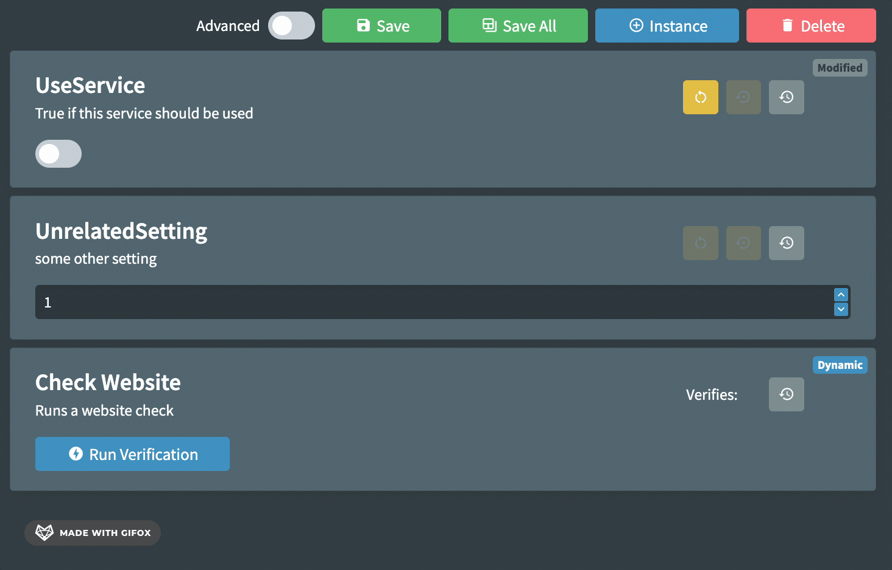

# Dependent Settings

`[EnablesSettings]` hides named settings when a **bool** property is `false`, and shows them when it is `true`. It is **obsolete**. Use [`[DependsOn]`](./22-conditional-settings.md) instead: apply `DependsOn` to the *child* settings, not the parent.

```csharp
[Setting("Enable authentication")]
public bool UseAuthentication { get; set; } = false;

[Setting("The username when logging into the service.")]
[DependsOn(nameof(UseAuthentication), true)]
public string? ServiceUsername { get; set; }

[Setting("The password corresponding to the supplied username.")]
[Secret]
[DependsOn(nameof(UseAuthentication), true)]
public string? ServicePassword { get; set; }
```

`DependsOn` also works with non-boolean controllers (enums, strings, and specific values). Display scripts can hide settings with even more flexibility — see [Display Scripts](./8-display-scripts.md).

## Appearance



