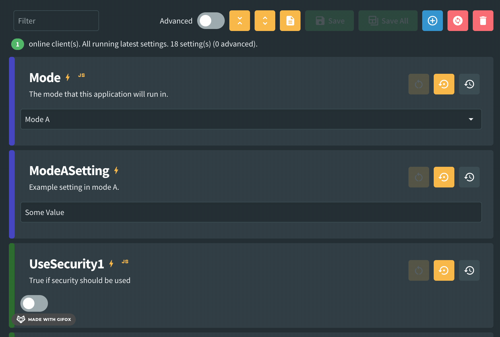
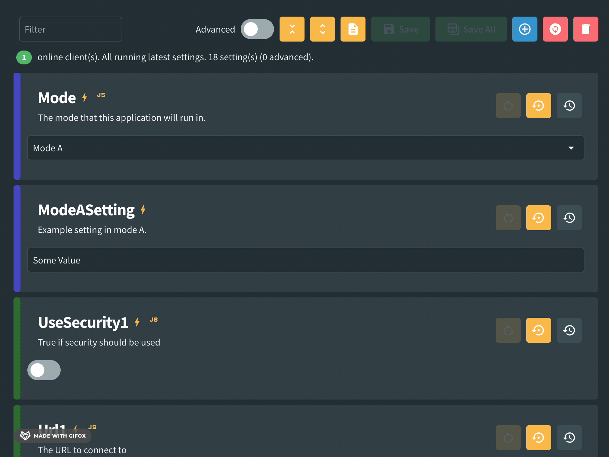
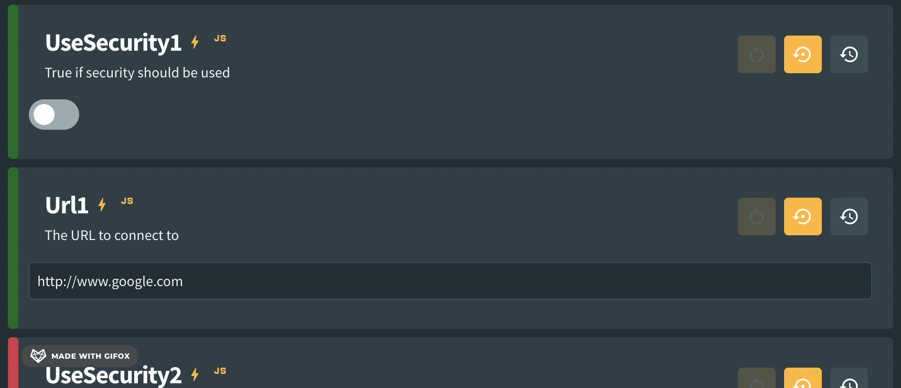
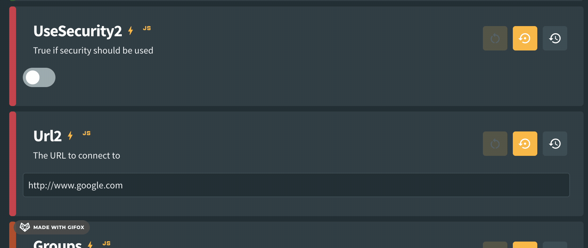
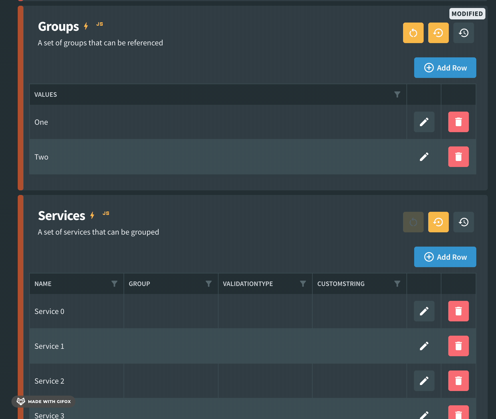
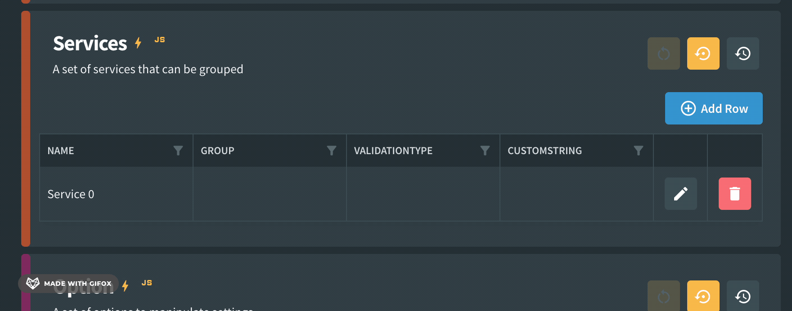
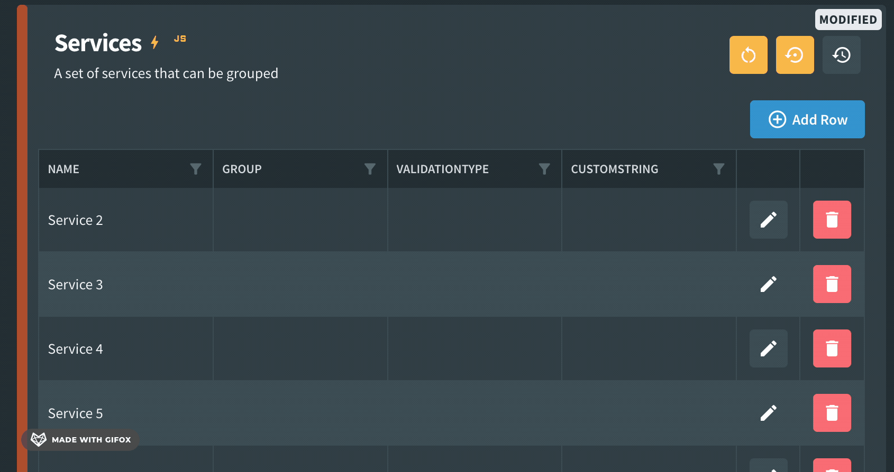

# Display Scripts

Display scripts a javascript code snippets that allow for automated actions related to the display of settings within the Fig Web application. They can be added to any setting and will be executed when the web application is loaded or when the setting value is changed.

Display scripts provide the freedom to automate how settings are displayed or validated to make the configuration experience as intuitive as possibe. For example, Fig supports validation of settings based on a regular expression. However, with display scripts, settings can be validated via code and can even take into account the values of other settings within that client. All settings within that client are loaded into the javascript context and can be read or written to.

The javascript engine is powered by [Jint](https://github.com/sebastienros/jint). It has limited functionality as there are no modules or packages loaded so this means only vanilla javascript code is permitted.



## Code Interface

The following interface is available for each non data grid setting within a client:

```csharp
string Name { get; }
bool IsValid { get; set; }
string ValidationExplanation { get; set; }
bool Advanced { get; set; }
int EditorLineCount { get; set; }
int DisplayOrder { get; set; }
bool IsVisible { get; set; }
string CategoryColor { get; set; }
string CategoryName { get; set; }
string[] ValidValues { get; set; }
bool IsReadOnly { get; set; }
object? Value { get; set; }
void log(string message)
```

For example, if you wanted to change if a setting (``ModeASetting`) is visible depending on the value of another setting (`Mode`), you could write the following:

```javascript
if (Mode.Value == 'Mode A') {
	ModeASetting.IsVisible = true;
} else {
	ModeASetting.IsVisible = false;
}
```

**Data grids** have a different interface to allow developers to apply rules to individual cells within the grid. The interface is as follows:

```csharp
string Name { get; }
ExpandoObject[] ValidationErrors { get; set; }
bool Advanced { get; set; }
ExpandoObject[] EditorLineCount { get; set; }
int DisplayOrder { get; set; }
bool IsVisible { get; set; }
string CategoryColor { get; set; }
string CategoryName { get; set; }
ExpandoObject[] ValidValues { get; set; }
ExpandoObject[] IsReadOnly { get; set; }
ExpandoObject[]? Value { get; set; }
void log(string message)
```

The expando object maps to a `Dictionary<string, object?>` where the string is the property name (the name of the column) and the object is the relevent value. Depending on the property, it may be a bool, string array, string, etc.

For example, to set the age for the second row of a data grid called `People` with 3 rows and columns Name, Age, Pet, the following code will do that:

```javascript
People.Value[1].Age = 55
```

Alternatively, the following code will set the valid values for the pet property:

```javascript
People.ValidValues[1].Pet = ['Cat', 'Dog', 'Fish']
```

| Property Name         | Description                                                  | Example                                                      |
| --------------------- | ------------------------------------------------------------ | ------------------------------------------------------------ |
| Name                  | The name of the setting. This value can only be read and not written to. | `log(MySetting.Name)`                                        |
| IsValid               | False if the value of this setting is not valid. In this case, the ValidationExplanation will be shown below the setting. | `MySetting.IsValid = false`                                  |
| ValidationExplanation | The text that will show if the setting is not valid.         | `MySetting.ValidationExplanation = 'Some reason'`            |
| ValidationErrors      | This is an array of expando objects which is a string for each cell in the data grid. If any cell has a validation error, it will be automatically displayed below the setting. If multiple have errors, they will be summarized below. Note that you'll need to set the individual validation error property to null to clear that validation error. | `MySetting.ValidationErrors[0].Name = 'Name must be set'`    |
| Advanced              | True if this setting should be hidden unless the advanced flag is set to show those settings. | `MySetting.Advanced = true`                                  |
| EditorLineCount       | The number of lines that the setting should have displayed. **Note:** to use this setting, you must have set this property via attribute first. | `MySetting.EditorLineCount = 4`<br />`MySetting.EditorLineCount[2].Description = 2` |
| DisplayOrder          | The order that the setting will appear within the UI         | `MySetting.DisplayOrder = 6`                                 |
| IsVisible             | If this setting should be displayed or hidden.               | `MySetting.IsVisible = false`                                |
| CategoryColor         | The color used on the left hand side of the setting to show its category. Note that this must be a hex value | `MySetting.CategoryColor = '#8a2d69'`                        |
| CategoryName          | The name used in the category tooltip.                       | `MySetting.CategoryName = 'Important'`                       |
| ValidValues           | The values presented in the dropdown for setting or data grid cell. **Note:** To use valid values, there must be at least one value set via attribute. | `MySetting.ValidValues = ['Cat', 'Dog', 'Fish']`<br />`MySetting.ValidValues[2].Pet = ['Cat', 'Dog', 'Fish']` |
| IsReadOnly            | If the setting or cell shoud be read only.                   | `MySetting.IsReadOnly = true`<br />`MySetting.IsReadOnly[2].Name = true` |
| Value                 | The value for the setting or cell.                           | `MySetting.Value = 'new value'`<br />`MySetting.Value[2].Name = 'new value'` |
| log(string message)   | This is a method that allows you to log to the browser console which can be useful when troubleshooting scripts. | `log('my message')`                                          |

### Enums

Fig treats enum values as strings outside of the application so they should be considered strings when working with them in the display scripts.

### Nested Settings

For nested settings, they can be accessed using their **leaf property name** directly, or using `.` notation for the full path.

For example, for the following nested setting:

```csharp
    ...

    [NestedSetting]
    public DatabaseConnection Connection { get; set; } = new();

    ...

    public class DatabaseConnection
    {
        [Setting("Database server port")]
        public int Port { get; set; } = 5432;
    }

```

It can be accessed by leaf name:

```javascript
// Set the value to 50
Port.Value = 50;
```

Or by dot notation:

```javascript
// Set the value to 50
Connection.Port.Value = 50;
```

If there are multiple levels of nesting, use a dot between each level (e.g., `App.Connection.Port.Value`).

:::note
If a leaf property name conflicts with a top-level setting name, the top-level setting takes priority. Use dot notation to access the nested setting in this case.

If two nested settings share the same leaf name (e.g., `Database1->Timeout` and `Database2->Timeout`), use dot notation to disambiguate (e.g., `Database1.Timeout` and `Database2.Timeout`).
:::

## Security

There are a number of security features related to this feature:

1. Display scripts are disabled by default and must be enabled in the Fig settings by an administrator. If a client uses display scripts and they are disabled, a notification will be shown to let the user know that some features might not work.
2. Display scripts will be executed within the Web Assembly sandbox. Web assembly within the browser has a limited interface which for example restricts access to the users local computer. This limits the potential for any malicious activity.
3. Display scripts are executed within the Jint runtime engine sandbox. The engine where the scripts are executed has a very limited context. The only available objects are the settings for that client and the only method is the log method. There are no libraries or packages available and only vanilla javascript code is permitted. This further limits what can be written.
4. Display scripts cannot execute for longer than 5 seconds. In testing, most execute in under 300ms.
5. There is infinate loop protection in place. If one script updates another property value and it has a script that updates the first property value there is the potential for an infinate loop. There is code in place to detect this and cut it off after a few seconds. However developers should be careful not to build this into their clients.
6. Display scripts are executed on a background thread to prevent UI slowness.
7. A hash of the javascript code is stored in the database to prevent tampering.

With these security features, Display Scripts should be a pretty safe feature to use and offers a lot of benifits. However with any code there may be some risks and if the origin of all clients is unknown, consider leaving the scripts disabled. If you find any security flaws with this feature, please raise a GitHub issue.

## Examples

The following examples show what is possible with this feature.

### Application with different modes

Some applications might run in two or more modes with different settings relevent depending on the selected mode. In this case, irrelevant and unused settings can be hidden unless that mode is selected.



```csharp
[Setting("The mode that this application will run in.")]
[ValidValues("Mode A", "Mode B")]
[Category("Mode Example", CategoryColor.Blue)]
[DisplayScript(Scripts.SelectMode)]
[DisplayOrder(1)]
public string Mode { get; set; } = "Mode A";

[Setting("Example setting in mode A.")]
[Category("Mode Example", CategoryColor.Blue)]
[DisplayOrder(2)]
public string ModeASetting { get; set; } = "Some Value";

[Setting("Example setting in mode B.")]
[Category("Mode Example", CategoryColor.Blue)]
[DisplayOrder(3)]
public string ModeBSetting1 { get; set; } = "Thing";

[Setting("Another example setting in mode B.")]
[Category("Mode Example", CategoryColor.Blue)]
[DisplayOrder(4)]
public string ModeBSetting2 { get; set; } = "Another thing";

public static class Scripts
{
  public const string SelectMode = @"if (Mode.Value == 'Mode A') {
ModeASetting.IsVisible = true;
ModeBSetting1.IsVisible = false;
ModeBSetting2.IsVisible = false;
log('mode A selected')
} else {
ModeASetting.IsVisible = false;
ModeBSetting1.IsVisible = true;
ModeBSetting2.IsVisible = true;
log('mode B selected')
}";
}
```

### Setting Validation based on another setting

Validate one setting based on the value of another.



```csharp
[Setting("True if security should be used")]
[Category("Multi Setting Validation Example", CategoryColor.Green)]
[DisplayOrder(5)]
[DisplayScript(Scripts.ValidateSecurity)]
public bool UseSecurity1 { get; set; }

[Setting("The URL to connect to")]
[Category("Multi Setting Validation Example", CategoryColor.Green)]
[DisplayOrder(6)]
[DisplayScript(Scripts.ValidateSecurity)]
public string Url1 { get; set; } = "http://www.google.com";

public static class Scripts
{
  public const string ValidateSecurity = @"
var prefix = Url1.Value.slice(0, 5);
if (UseSecurity1.Value && prefix.toLowerCase() != 'https') {
Url1.IsValid = false;
Url1.ValidationExplanation = 'If security is used then the url should start with https';
} else if (!UseSecurity1.Value && prefix.toLowerCase() == 'https') {
   Url1.IsValid = false;
   Url1.ValidationExplanation = 'If security is not used then the url should not start with https';
} else {
Url1.IsValid = true;
}";
}
```

### Setting update based on the value of another setting

Automatically update the value of a setting when another setting changes.



```csharp
[Setting("True if security should be used")]
[Category("Multi Setting Value Update Example", CategoryColor.Red)]
[DisplayOrder(7)]
[DisplayScript(Scripts.AutoUpdateValue)]
public bool UseSecurity2 { get; set; }

[Setting("The URL to connect to")]
[Category("Multi Setting Value Update Example", CategoryColor.Red)]
[DisplayOrder(8)]
[DisplayScript(Scripts.AutoUpdateValue)]
public string Url2 { get; set; } = "http://www.google.com";

public static class Scripts
{
  public const string AutoUpdateValue = @"
if (UseSecurity2.Value) {
Url2.Value = Url2.Value.replace('http://', 'https://');
log('After: ' + Url2.Value)
} else {
log('Before2: ' + Url2.Value)
Url2.Value = Url2.Value.replace('https://', 'http://');
log('After2: ' + Url2.Value)
}";
}
```

### Dynamic Dropdowns

Automatically populate dropdown values based on the value of another setting.



```csharp
[Setting("A set of groups that can be referenced")]
[Category("Dynamic Valid Values Example", CategoryColor.Orange)]
[DisplayOrder(9)]
[DisplayScript(Scripts.UpdateValidValues)]
public List<string>? Groups { get; set; }

[Setting("A set of services that can be grouped", defaultValueMethodName:nameof(GetDefaultServices))]
[Category("Dynamic Valid Values Example", CategoryColor.Orange)]
[DisplayOrder(10)]
[DisplayScript(Scripts.UpdateValidValues)]
public List<Service>? Services { get; set; }

public class Service
{
    public string Name { get; set; }
    
    [ValidValues("Placeholder")]
    public string Group { get; set; }
    
    [ValidValues("200OK", "Custom String")]
    public string ValidationType { get; set; }
    
    public string CustomString { get; set; }
}

public static class Scripts
{
   public const string UpdateValidValues = @"
const validGroups = Groups.Value.map(a => a.Values);
for (let item of Services.ValidValues) {
item.Group = validGroups;
}";
}
```

### Validate Data Grid Cell

Validate an individual cell in a data grid.



```csharp
[Setting("A set of services that can be grouped", defaultValueMethodName:nameof(GetDefaultServices))]
[Category("Dynamic Valid Values Example", CategoryColor.Orange)]
[DisplayOrder(10)]
[DisplayScript(Scripts.ValidateCell)]
public List<Service>? Services { get; set; }

public class Service
{
    public string Name { get; set; }
    
    [ValidValues("Placeholder")]
    public string Group { get; set; }
    
    [ValidValues("200OK", "Custom String")]
    public string ValidationType { get; set; }
    
    public string CustomString { get; set; }
}

public static class Scripts
{
   public const string ValidateCell = @"
for (let i = 0; i < Services.Value.length; i++) {
    if (!Services.Value[i].Name) {
        Services.ValidationErrors[i].Name = 'name should not be blank';
    } else {
       Services.ValidationErrors[i].Name = null;
    }
}
";
}
```

### Dynamic read only sections

Automatically enable some data grid fields depending on other values in that row.



```csharp
[Setting("A set of services that can be grouped", defaultValueMethodName:nameof(GetDefaultServices))]
[Category("Dynamic Read only sections Example", CategoryColor.Orange)]
[DisplayOrder(10)]
[DisplayScript(Scripts.ReadOnlyCell)]
public List<Service>? Services { get; set; }

public class Service
{
    public string Name { get; set; }
    
    [ValidValues("Placeholder")]
    public string Group { get; set; }
    
    [ValidValues("200OK", "Custom String")]
    public string ValidationType { get; set; }
    
    public string CustomString { get; set; }
}

public static class Scripts
{
   public const string ReadOnlyCell = @"

for (let i = 0; i < Services.Value.length; i++) {
    if (Services.Value[i].ValidationType == 'Custom String') {
        Services.IsReadOnly[i].CustomString = false;
    } else {
        Services.IsReadOnly[i].CustomString = true;
    }
}
";
}
```
