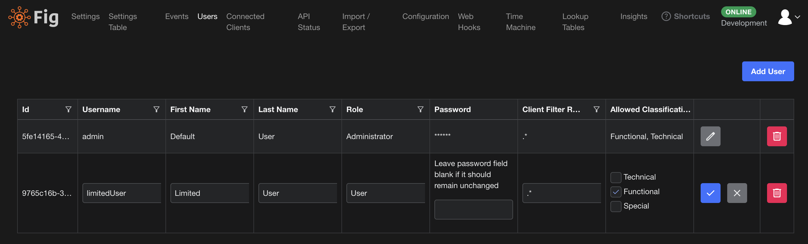

# Classifications

Classifications are a way of limiting access to certain settings to certain users.

There are 3 possible classifications:

- Technical - these are settings which configure the technical aspects of an application
- Functional - these are settings which effect the function of the application
- Special - this is a spare cateogry of settings

While there is a description against each classification above, in reality these can be used for any purpose and there is no difference between each classification.

Classifications are set on a per setting basis. By default, all settings are classified as Technical. If you don't intend to use this feature, no changes are required.

To use the feature, set some settings to be functional or special settings:

```csharp
[Setting("This is a functional setting", classification: Classification.Functional)]
public string FunctionalSetting { get; set; } = "Func";
```

In the user configuration, it is then possible to remove access to certain categories of settings on a per user basis.



Users will only see settings that have classifications that are included in their list of allowed classifications. If a user cannot see any settings for a client, the whole client will be excluded. This also prevents users from updating settings they do not have permission for.

This setting can essentially be used to provide limited access to a few settings for a specific user or group of users.