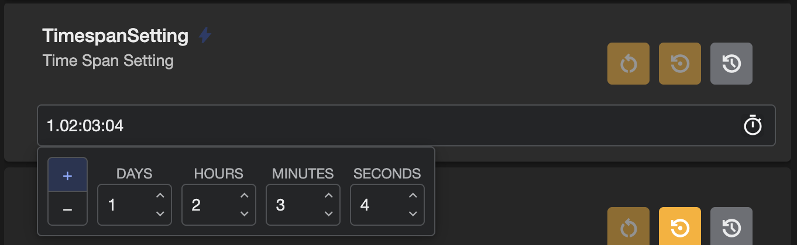

# Supported Types

Fig supports most c# property types out of the box with customized editors for each type. More complex types are supported using data grids or JSON.

Some of the settings such as strings and ints also support other capabilities such as **valid value dropdown** or **validation**.

## String

Text based settings.

***Note**: If nullable settings are enabled, strings must either be nullable or have a default value.*

## Bool

True or false values.

## Double

Decimal numbers. Nullable values are also supported.

## Int

Whole numbers. Nullable values are also supported.

## Long

Larger whole numbers. Nullable values are also supported.

## DateTime

Date and Time

## TimeSpan

A time range.

## Enums

Enums or Nullable enums.

***Note:** Nullable enums with default values are not supported as the default value will be used when Fig tries to set the value to null.*

## Data Grid

Data grids can be used to group multiple values in a collection. For example a data grid can be used for list of strings or integers or it could be a collection of objects where the class definition for the object contains multiple properties of different types.

## JSON

JSON representation of a class. This is the fallback mode for Fig if it cannot find another match for this property type.

## The following types are NOT supported

**SecureString** - Not recommended for use by Microsoft in dotnet core. See [here](https://github.com/dotnet/platform-compat/blob/master/docs/DE0001.md).

**`List<KeyValuePair<T1,T2>>`** - List of base types (e.g. `List<string>`) are supported but not complex types.

**Other complex types** - A basic object can probably work as a JSON string but as it needs to be parsed correctly into the setting provider format, it is not guaranteed to work correctly. You'll need to test the setting implementation to see.

**Arrays** - Lists are supported but arrays are not (e.g. use `List<string>` instead of `string[]`)
