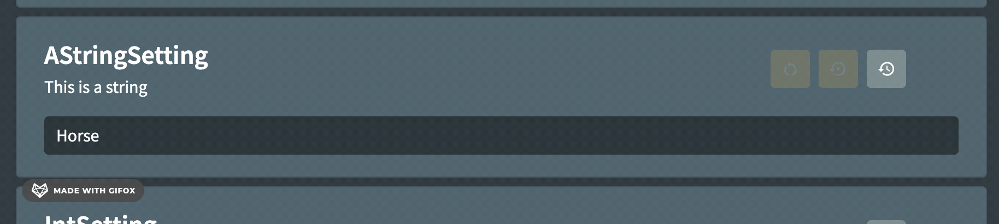

# Validation

String, integer or long type settings can have custom regular expression that will be used to validate the setting. If a value is entered that does not match the regex then a custom message will be shown to the person configuring the setting and saving will not be allowed.

## Usage

```csharp
[Setting("This is a string", "Horse")]
[Validation("[0-9a-zA-Z]{5,}", "Must have 5 or more characters")]
public string AStringSetting { get; set; } = null!;
```

## Appearance

