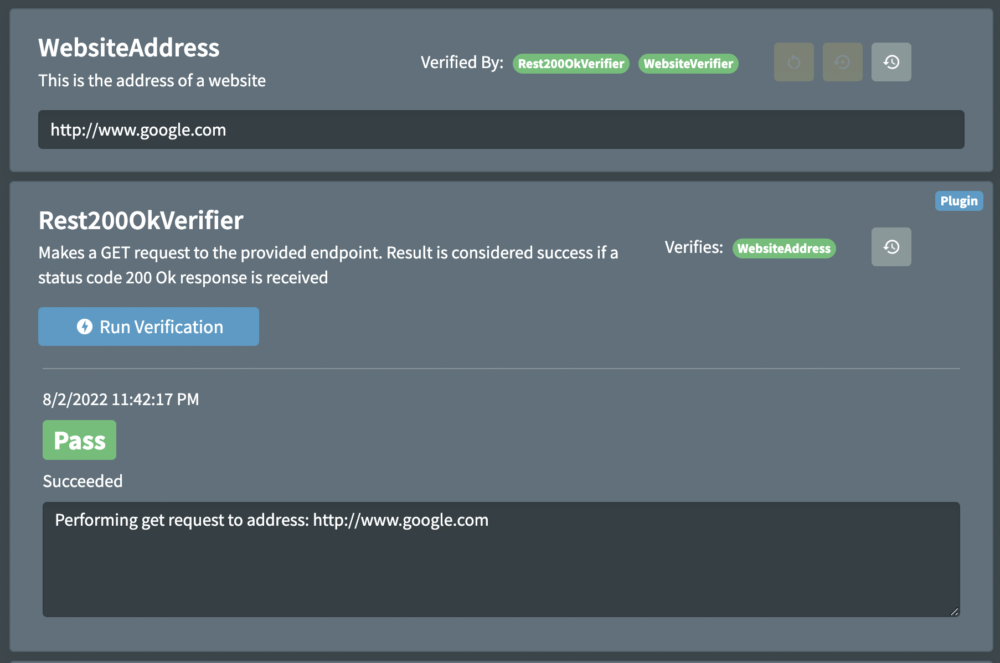

# Verification

Verification attrbutes can be added to classes to enable verification from within the Web Client.

For details on how to create verifications, see the [Verifications](http://www.figsettings.com/docs/features/verifications) page.

## Usage

There are 2 types:

### Plug In Verifications

```csharp
[Verification("Rest200OkVerifier", nameof(WebsiteAddress))]
public class ProductService : SettingsBase
```

### Dynamic Verifications

```csharp
[Verification("WebsiteVerifier", "VerifiesWebsites", typeof(WebsiteVerifier), TargetRuntime.Dotnet6, nameof(WebsiteAddress))]
public class ProductService : SettingsBase
```

Appearance




