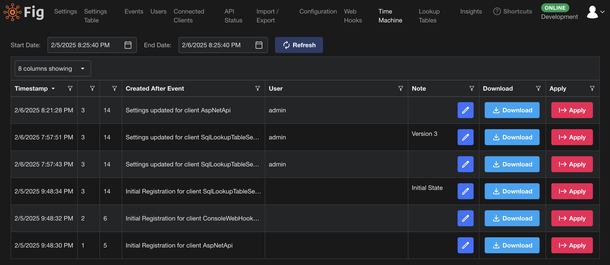

# Time Machine

Fig features a built in time machine feature which allows users to reset the settings back to how they were at an earlier point in time.
The feature works by taking an export of all settings whenever a change is made within the solution and then this export is saved in the database.

These checkpoints can then be downloaded or 'applied' to revert Fig back to the state where it was when the snapshot was taken.

Notes can be added against specific snapshots to make them easier to identify later.

## Disabling Time Machine

It is possible to disable the creation of checkpoints within the Fig admin configuration page. This will not remove any existing checkpoints but no new checkpoints will be created while the feature is disabled.