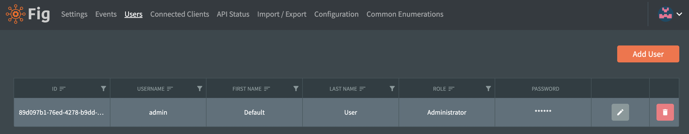

# User Management

Administrators in the Fig web client have the ability to manage users. They are able to create and delete users (or other administrators) as well as set and reset passwords.

All users can change their own password using the avatar image in the top right corner.

