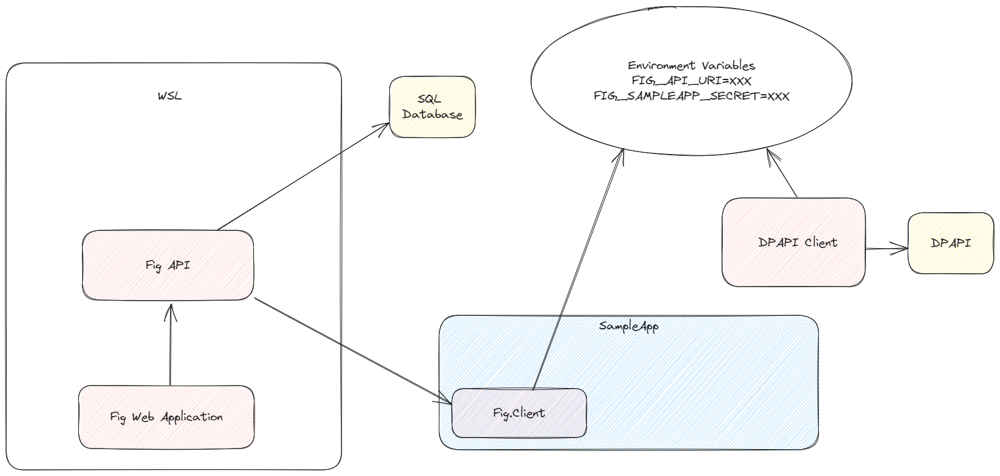

# Introduction

<iframe width="100%" height="450" src="https://www.youtube.com/embed/-2Bth4m0RcM?si=VKaqJBLBLMdFKRLH" title="15 new features in Fig 2.0" frameborder="0" allow="accelerometer; autoplay; clipboard-write; encrypted-media; gyroscope; picture-in-picture; web-share" allowfullscreen></iframe>

# Quick Start

To get up and running with Fig, you'll need to set up the API, Web and integrate the `Fig.Client` nuget package into your application.

## Install API and Web Client

The API and Web Clients can be installed using Docker. This guide assumes docker is installed and running.

1. Clone the [fig repository](https://github.com/mzbrau/fig) and use the `docker-compose.yml` file included.

2. Open a terminal / command prompt, navigate to the directory containing the docker-compose file and type `docker-compose up` to download the containers and run them.

## Log in to Web Client

Navigate to `http://localhost:7148` and at the login prompt enter user: `admin` password: `admin`. You should see the administration view of fig with all options available.

## Integrate Client

:::tip

In this guide, we'll create an ASP.NET project from scratch and integrate the `Fig.Client` to use fig for configuration. However the same instructions apply if you have an existing project. Just skip the project creation.

:::

1. Create new ASP.NET project

```bash
dotnet new webapi
```

2. Open the project in your favourite IDE

3. Add **[Fig.Client](https://www.nuget.org/packages/Fig.Client)** nuget package. You might want to add a secret provider nuget package too

4. Create a new class to hold your application settings, extending the SettingsBase class. For example:

   ```csharp
   public class ExampleSettings : SettingsBase
   {
       public override string ClientName => "ExampleService";
   
       [Setting("My favourite animal")]
       public string FavouriteAnimal { get; set; } = "Cow"
   
       [Setting("My favourite number")]
       public int FavouriteNumber { get; set; } = 66;
       
       [Setting("True or false, your choice...")]
       public bool TrueOrFalse { get; set; } = true;
   }
   ```

5. Register Fig as a configuration provider in the `program.cs` file.

   ```csharp
   builder.Configuration.SetBasePath(GetBasePath())
    .AddJsonFile("appsettings.json", optional: true, reloadOnChange: true)
    .AddFig<Settings>(options =>
    {
        options.ClientName = "AspNetApi";
        options.LoggerFactory = loggerFactory;
        options.CommandLineArgs = args;
        //options.ClientSecretProviders = [new DockerSecretProvider(), new DpapiSecretProvider()]; // if you added a secret provider
        o.ClientSecretOverride = "be633c90474448c382c47045b2e172d5xx"; // not for production use, use a secret provider
    });
   ```

6. Register Fig with the host:

```csharp
builder.Host.UseFig<Settings>();
```

7. Access the settings via the `IOptions` or `IOptionsMonitor` interface. E.g.

   ```csharp
   public WeatherForecastController(IOptionsMonitor<ExampleSettings> settings)
   {
       _settings = settings;
   }
   ```

8. Add an environment variable called `FIG_API_URI` with the URI of the Fig API. For example:

   ```bash
   FIG_API_URI=https://localhost:7281
   ```

9. Add a client secret (see [Client Secrets](./features/28-client-secrets/1-client-secret-providers.md) section for details on how to do that)

See the **examples folder** in the source repository for more examples.

## Fig NuGet Packages

Fig provides several NuGet packages to support different integration scenarios and environments:

### Core Packages

#### [Fig.Client](https://www.nuget.org/packages/Fig.Client)

The main client library for integrating Fig into your applications. This is the primary package you'll need for most scenarios.

- **Description**: Client library to include in your project when using Fig managed settings
- **Target Framework**: .NET Standard 2.0
- **Usage**: Configuration management, settings integration
- **Documentation**: [Client Configuration](./client-configuration.md)

#### [Fig.Client.Abstractions](https://www.nuget.org/packages/Fig.Client.Abstractions)

Lightweight abstractions and attributes for Fig configuration settings that can be referenced by third-party libraries without requiring the full Fig.Client package.

- **Description**: Abstractions and attributes for Fig configuration settings
- **Target Framework**: .NET Standard 2.0
- **Usage**: Third-party library integration, minimal dependencies
- **Documentation**: See active pull request for integration scenarios

### Secret Provider Packages

Fig supports secure secret management through specialized provider packages:

#### [Fig.Client.SecretProvider.Azure](https://www.nuget.org/packages/Fig.Client.SecretProvider.Azure)

Azure Key Vault integration for secure secret management.

- **Description**: Fig secret provider for Azure Key Vault
- **Documentation**: [Azure KeyVault Integration](./features/26-azure-keyvault-integration.md)

#### [Fig.Client.SecretProvider.Aws](https://www.nuget.org/packages/Fig.Client.SecretProvider.Aws)

AWS Secrets Manager integration for secure secret management.

- **Description**: Fig secret provider for AWS Secrets Manager

#### [Fig.Client.SecretProvider.Google](https://www.nuget.org/packages/Fig.Client.SecretProvider.Google)

Google Cloud Secret Manager integration for secure secret management.

- **Description**: Fig secret provider for Google Cloud Secret Manager

#### [Fig.Client.SecretProvider.Docker](https://www.nuget.org/packages/Fig.Client.SecretProvider.Docker)

Docker secrets integration for containerized environments.

- **Description**: Fig secret provider for Docker secrets

#### [Fig.Client.SecretProvider.Dpapi](https://www.nuget.org/packages/Fig.Client.SecretProvider.Dpapi)

Windows Data Protection API (DPAPI) integration for Windows environments.

- **Description**: Fig secret provider for DPAPI
- **Platform**: Windows only

### Testing and Development Packages

#### [Fig.Client.Testing](https://www.nuget.org/packages/Fig.Client.Testing)

Testing framework for Fig clients that allows developers to unit and integration test settings-related functionality.

- **Description**: A testing framework for Fig clients for unit and integration testing
- **Usage**: Unit testing, integration testing, development workflows

#### [Fig.Client.Contracts](https://www.nuget.org/packages/Fig.Client.Contracts)

Internal contracts and interfaces used by Fig client components.

- **Description**: Fig client contracts
- **Usage**: Internal package, typically not directly referenced

### Installation Examples

**Basic Fig integration:**

```bash
dotnet add package Fig.Client
```

**With Azure Key Vault:**

```bash
dotnet add package Fig.Client
dotnet add package Fig.Client.SecretProvider.Azure
```

**With testing support:**

```bash
dotnet add package Fig.Client
dotnet add package Fig.Client.Testing
```

**For third-party libraries (minimal dependencies):**

```bash
dotnet add package Fig.Client.Abstractions
```

### Documentation Links

- [Client Configuration](./client-configuration.md) - Basic Fig.Client setup
- [Client Secrets](./features/28-client-secrets/) - Secret provider configuration
- [Azure KeyVault Integration](./features/26-azure-keyvault-integration.md) - Azure-specific setup
- [Examples](./examples.md) - Code examples and usage patterns

## Example Setup using WSL


