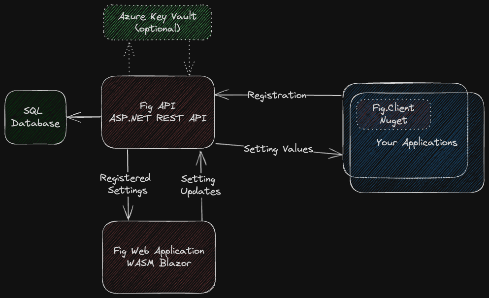

# Architecture

Fig is a centralized settings-management system for .NET services. Operators manage values in Fig Web; applications consume them through the ASP.NET configuration system (`IOptions` / `IOptionsMonitor`).

## Components

| Component | Role |
| --------- | ---- |
| **Fig.Client** | NuGet package in each application. Registers setting definitions, authenticates with a client secret, polls for updates, and can cache encrypted offline settings. |
| **Fig.Api** | Stateless HTTP API. Owns the database, encryption, authentication, reports, webhooks, and admin operations. |
| **Fig.Web** | Blazor WebAssembly UI. Talks only to the API (not the database). |
| **Fig.Mcp** | Optional MCP server that proxies AI tools to the API over HTTP. Does not open the database. See [Fig MCP Server](../integrations/fig-mcp-server.md). |
| **Fig.Aspire** | AppHost helpers to run API and Web containers. See [Aspire integration](../guides/9-aspire-integration.md). |
| **PowerShell module** | `scripts/fig-sdk.psm1` for CD pipelines. See [PowerShell](../powershell.md). |

API and Web are typically run as Docker containers (or via Aspire). A **setting client** is any .NET project with `Fig.Client` installed. After registration, its settings are stored in the Fig database and managed from the web application.

Multiple API instances can run against the same database for availability. Clients keep an encrypted local cache so they can start if the API is briefly unreachable.
