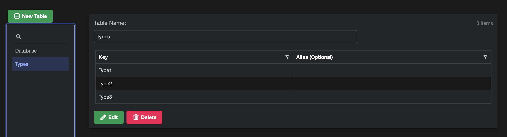
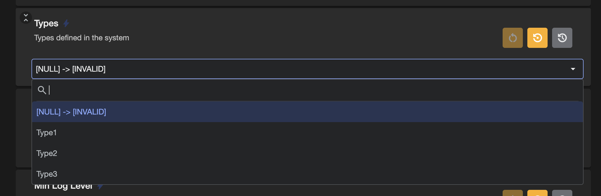
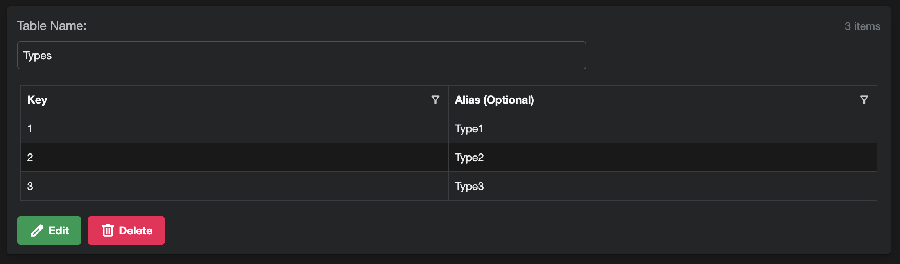
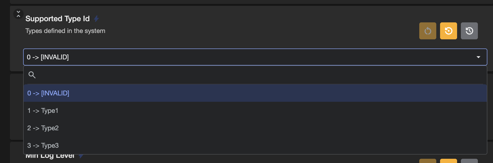

# Lookup Tables

Fig supports the concept of lookup tables. This is where a set of setting values supplied by a client can be used to create a dropdown to help the user select a valid value.

There are 2 potential use cases for this feature:

- Constraining the user to a set of valid values that are not known at the time of writing the application.
- Adding a helpful alias to dropdown values to make it easier to understand.

## Valid Values

Fig has support for adding [valid values](../features/settings-management/19-valid-values.md) in the application and this assists the user to input a valid value by constraining their choices to a set of valid options.

However, in some cases, the list of valid options is now known. Consider the case where an application integrates towards an external system. The external system has a configurable structure where types can be configured. The application does not know ahead of types which types will be configured, but these are known at runtime. A lookup table can be created containing all the configured types and then in the application configuration, a dropdown will be created with the types for use.

```csharp
[Setting("Types defined in the system")]
[LookupTable("Types")]
public string? Types { get; set; }
```

With this lookup table defined:

  
*Lookup table without an alias defined*

The user gets a drop down list.

  
*Dropdown defined by the lookup table*

If the existing value is not in the list, it is added but marked as invalid.

If no lookup table is defined, the property is just handled as a normal string property.

## Alias

Another example of where this feature might be useful is providing context to meaningless values.

For example if your application needs to reference a database id defined by another system. The id will just be a number of guid and can be difficult to configure.

My adding mapping in the lookup table between the valid values and an alias of what they actually are, it can be easier to configure.


```csharp
[Setting("The id of the type that should be supported by this service")]
[LookupTable("Types")]
public long? SupportedTypeId { get; set; }
```

The lookup table is defined with an alias:



Then the dropdown contains alias items



When the user selects an item, only the value is set. The alias is just there for the user facing display.

## Editing Lookup Tables

When editing the lookup tables use a comma to separate the key and value and a new line to separate each row.

If there is no alias, just separate them by new lines.

You will need to reload the page for this change to take effect.

## Overriding via Environment Variable

The lookup table key can be overridden using an environment variable. It should be in the format `FIG_SettingName_LOOKUPTABLEKEY`

Use a value of 'null' to clear the current value.

## Lookup Table API

See [Lookup Table Integration](../integration-points/lookup-table-integration.md) for details.
