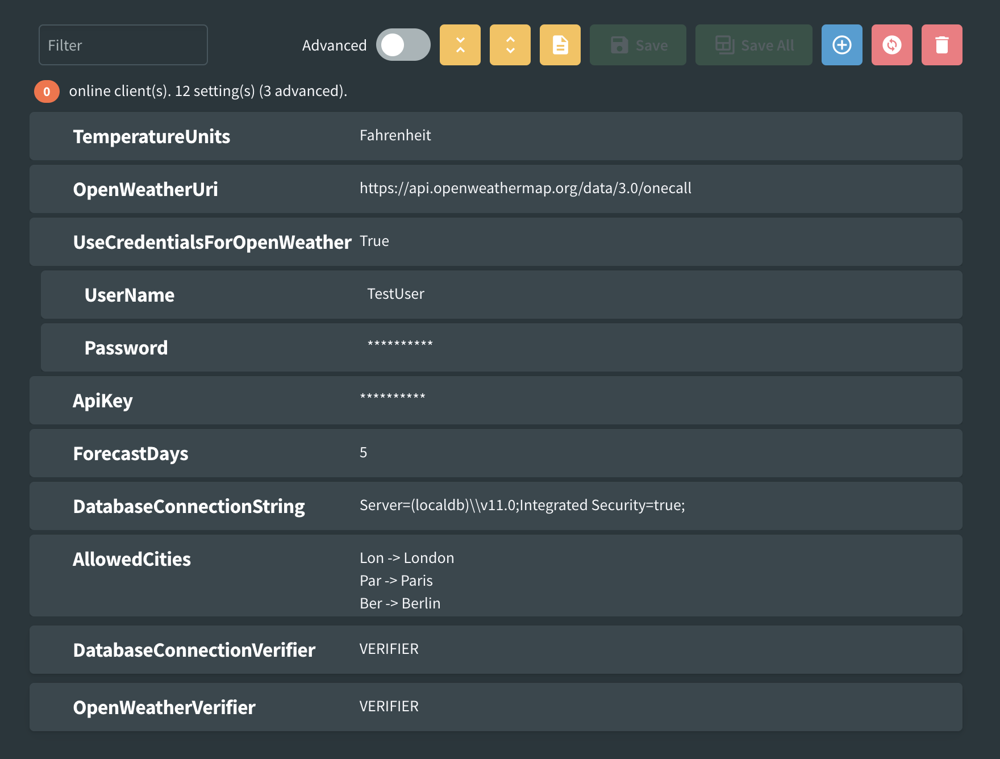

# Compact View

When there are lots of settings for a client or settings have large descriptions it can be difficult to get an overview of the settings and their values. This is where compact view can be useful. An individual setting can have their compact view toggled by clicking on the name. All settings under a client can be collapsed or expanded using the command buttons at the top of the settings.

In compact view, settings are read only and only the name and value are visible.

Compact view can be toggled for a whole category by holding down the control key while clicking the setting name. All other settings in that category will be toggled to match the one clicked.
