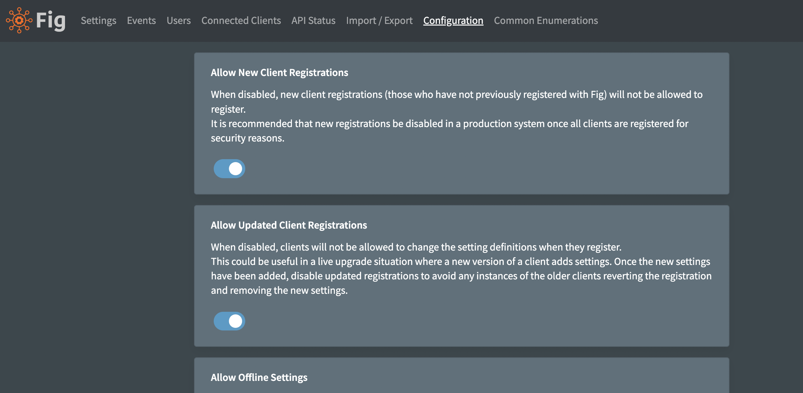

# Configuration

There are a few parameters which can be configured for Fig which enable or disable certain features in the application.

## Configuration Options

### Allow New Client Registrations

When disabled, new client registrations (those who have not previously registered with Fig) will not be allowed to register.

It is recommended that new registrations be disabled in a production system once all clients are registered for security reasons.

### Allow Updated Client Registrations

When disabled, clients will not be allowed to change the setting definitions when they register.

This could be useful in a live upgrade situation where a new version of a client adds settings. Once the new settings have been added, disable updated registrations to avoid any instances of the older clients reverting the registration and removing the new settings.

### Allow Offline Settings

Fig clients can save the settings values locally in a file so they client can still start even if the Fig API is down.

Settings are encrypted using the client secret and stored in a binary file. However, it may still be desirable to disable this feature if additional security is more important than up time.

### Allow File Imports

Fig supports loading export from an import directory. This is a useful feature when Fig is deployed in a container as a Helm chart or similar can be used to set the initial configuration.

However, depending on the level of access to the import directory, it may impose a security risk as imports can be configured to remove existing clients and settings.

### Allow Display Scripts

Display scripts provide flexibility when configuring the behavior of the settings for a specific client.

They should be quite safe as it has limited scope and runs within the web-assembly sandbox but it does involve executing code that has been written by a third party and as a result, if you don't trust all the registering clients, disabling this feature eliminates the possibility for misuse.

### Enable Time Machine

Time machine is a feature that takes regular snapshots of all setting values and saves them in the database.

Depending on the number of changes this could start to add up to a lot of data. It will also take a little longer to perform every setting update.

### Allow Client Overrides

Client overrides allow applications to override the setting value for settings based on an environment variable.

This can be useful for container deployments where you want to set container deployment specific values but still see an manage the settings in Fig.

Note that any settings changes will be reverted on the next client restart back to the environment variable value.

### Client Override Regex

If client overrides are enabled, only clients with names matching this regular expression will be allowed to override settings.

### Web Application Base Address

This is the address that users use to access the web application. It is used to generate links for web hooks.

### API Secret Encryption Migration

The API secret is used to encrypt data in the database. Good security practice says that it should be rotated periodically. When this occurs, all the encrypted data in the database needs to be re-encrypted with the new secret. The old secret should be set as the 'PreviousSecret' and then press this button to perform the migration.

:::note
All API instances should have the secret and previous set to the same values before attempting migration.
:::

### Azure Key Vault for Secrets (Experimental)

Azure Key Vault can be used to store secrets rather than storing them in the Fig database.
Fig only supports this configuration when Fig is deployed in Azure.
Before enabling this feature, ensure they Key Vault has been created and the Fig API has been granted access to read and write keys.

### Poll Interval Override (ms)

Fig clients poll every 30 seconds by default. This can be overridden via environment variable. This is a global override that will apply to all connected clients.

It is not recommended to set this value under 10000ms. Values under 2000ms are not allowed.

## Appearance

