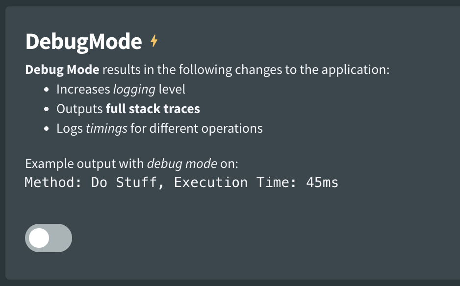
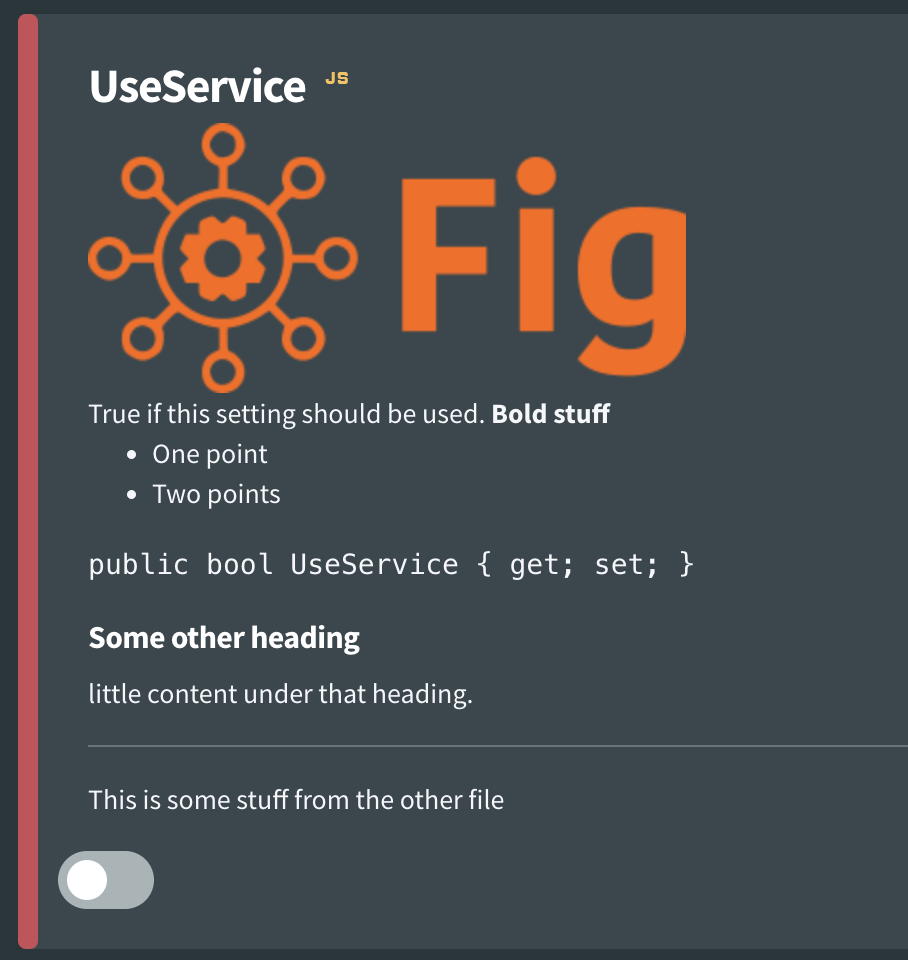

# Setting Descriptions

Descriptions should be supplied with each setting to explain what the setting does and any potential implications of changing it. Descriptions are provided within the `[Setting]` attribute.

A basic description might look like this:

``` csharp
[Setting("Turns on the debug mode", false)]
public bool DebugMode { get; set; }
```


However, setting descriptions also support **basic Markdown syntax** which allow developers to convey information in a format that is easy to understand and digest for the person performing the configuration. A detailed description is recommended and may look like this:

``` csharp
[Setting("**Debug Mode** results in the following changes to the application:\r\n" +
             "- Increases *logging* level\r\n" +
             "- Outputs **full stack traces**\r\n" +
             "- Logs *timings* for different operations \r\n" +
             "\r\nExample output with *debug mode* on:\r\n" +
             "```\r\nMethod: Do Stuff, Execution Time: 45ms\r\n```", false)]
public bool DebugMode { get; set; }
```

Which results in a more readable text description:



[Admonitions](https://docusaurus.io/docs/markdown-features/admonitions) within markdown files are also supported. The `internal` admonition type will be stipped from the content along with any document frontmatter.

## Setting Descriptions from Markdown Files

While the example above looks pretty good for the person configuring the application. It it is difficult to read for the developer. An easier way to manage the documentation is to store it in a markdown file which is an embedded resource in the application and then reference it in the fig configuration.

Steps are as follows:

1. Create a markdown file within the project (entry assembly) and give it a name (it doesn't matter what)
2. Make the markdown file an embedded resource in the project
3. Write your documentation within the markdown file
4. Reference the file within fig using the following syntax:

```csharp
$FullyQualifiedResourceName
```

OR

```csharp
$filenameWithoutExtension
```

Note: if using just the filename, there is a small risk of conflicting names. In that case, the first one will be used.

For example

```csharp
$Fig.Integration.SqlLookupTableService.ServiceDescription.md
```

OR

```csharp
$ServiceDescription
```

However, there might be many settings and in this case you don't want to create a markdown file per setting. Fig allows you to specify a section of a markdown file using the following syntax:

```csharp
$FullyQualifiedResourceName#HeadingName
```

OR

```csharp
$filenameWithoutExtension#HeadingName
```

For example

```csharp
$Fig.Integration.SqlLookupTableService.ServiceDescription.md#FigUri
```

OR

```csharp
$ServiceDescription#FigUri
```

This will take all the text and subheadings below that heading block, but not that heading block itself.

You can see a full working example of this [here](https://github.com/mzbrau/fig/blob/main/src/integrations/Fig.Integration.SqlLookupTableService/Settings.cs#L11).

Fig even supports multiple files separated by a comma. For example:

```csharp
$Service.ServiceDescription.md#FigUri,$Service.OtherDoc.md
```

Each section can be a full document or part of a document. A line is inserted between documents. Documents are added in the order they are provided.

## Images

Fig supports displaying images (`.png` and `.svg` files) in both setting descriptions and client descriptions.

To add images, take the following steps:

1. Reference the image in your markdown file e.g. ``
2. Add the image as an **embedded resource** in your application
3. That's it, Fig will do the rest. What happens behind the scenes is that Fig will replace the image path with a base64 encoded version of the image which means it can be embedded in the document. This is the version that is registered with the API.

In the image below, the Fig logo has been added to the markdown file and appears in the setting description.



## Links

External links are retained but internal links (link to other markdown files) are removed by Fig and don't appear in the UI.
