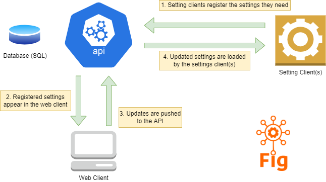

# Architecture

Fig is a complete solution for managing settings across multiple micro-services. It consists of three components: a client library, API and web front end.

The API and Web Client run inside Docker containers.

A setting client is any dotnet project with the Fig.Client nuget package installed. Once this package has been installed and the relevant configuration done in the project, Fig will manage any settings for the application. They will be stored in the Fig database and can be managed via the web client.