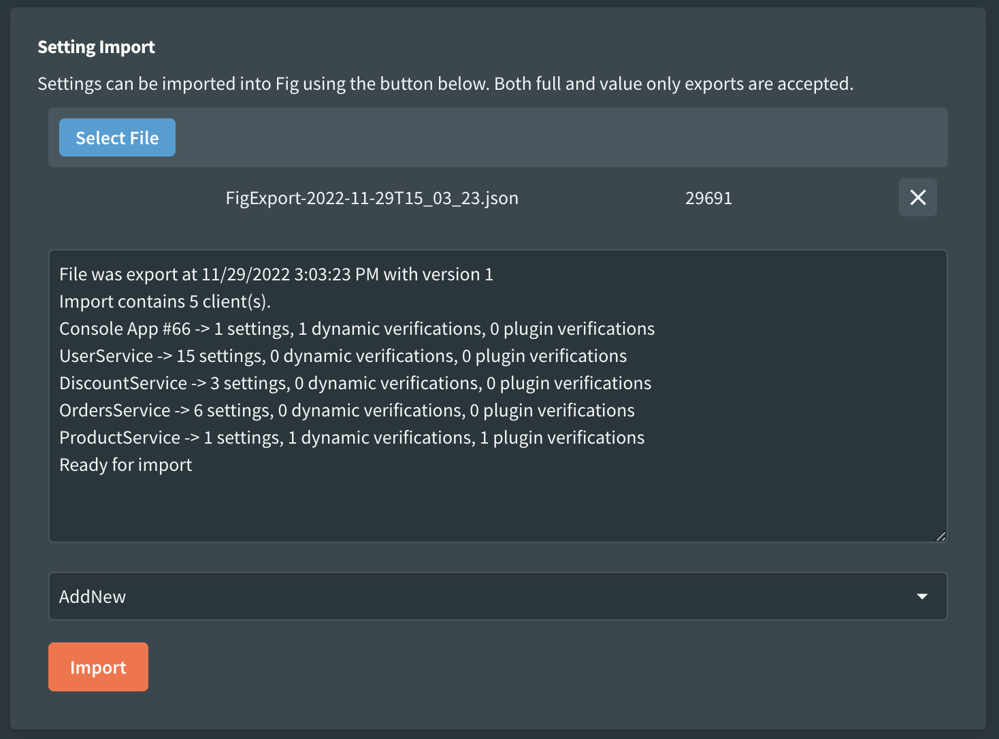
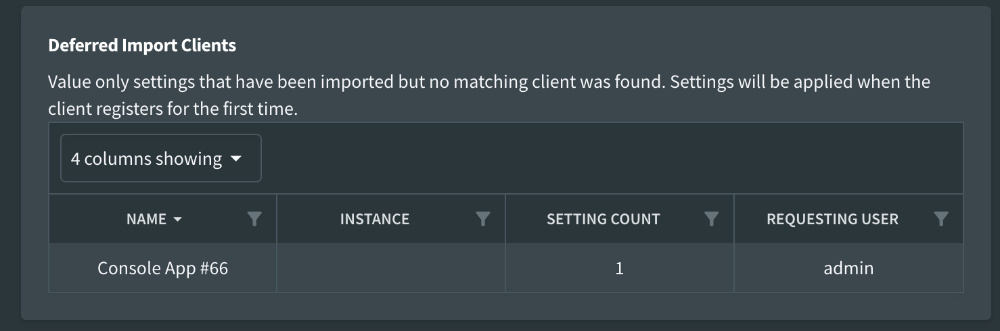

# Import / Export

Fig supports a number of different types of import and export.

| Type                    | Imported Supported | Export Supported |
| ----------------------- | ------------------ | ---------------- |
| Setting Export | Yes                | Yes              |
| Value Only              | Yes                | Yes              |
| Change Set Export       | Yes*               | Yes              |
| Markdown Format         | No                 | Yes              |

*Change Set exports can be imported using the same process as Value Only imports

## Setting Export

It is possible to import and export all client information from Fig. This allows the full configuration of Fig to be exported from one instance and imported into another. It can also be used for back up purposes.

### Export

When exporting, any secret settings will be exported in an encrypted format. This means that the server secret must be the same where they are imported or the Fig API will not be able to decrypt the values.

Exports are in a JSON format for value only exports or zipped json for full exports and can be performed from the Fig Web Application.

An example export might look like the following:

```json
{
  "$type": "Fig.Contracts.ImportExport.FigDataExportDataContract, Fig.Contracts",
  "Clients": [
    {
      "$type": "Fig.Contracts.ImportExport.SettingClientExportDataContract, Fig.Contracts",
      "ClientSecret": "$2a$11$rKzfhlOCbRGs5IZGkPBDxOPRJ8MbHLTCjWinc6vEZUdNHugDJkA/y",
      "Description": "AspNetApi Example",
      "Instance": null,
      "Name": "AspNetApi",
      "Settings": [
        {
          "$type": "Fig.Contracts.ImportExport.SettingExportDataContract, Fig.Contracts",
          "Advanced": false,
          "CategoryColor": null,
          "CategoryName": null,
          "Classification": 0,
          "DataGridDefinitionJson": null,
          "DefaultValue": {
            "$type": "Fig.Contracts.Settings.StringSettingDataContract, Fig.Contracts",
            "Value": "Melbourne"
          },
          "Description": "The name of the city to get weather for.",
          "DisplayOrder": 1,
          "DisplayScript": null,
          "EditorLineCount": null,
          "EnablesSettings": null,
          "Group": null,
          "IsEncrypted": false,
          "IsExternallyManaged": false,
          "IsSecret": false,
          "JsonSchema": null,
          "LastChanged": "2025-05-21T06:25:32.5420907Z",
          "LookupTableKey": null,
          "Name": "Location",
          "SupportsLiveUpdate": true,
          "ValidationExplanation": "Value cannot be empty",
          "ValidationRegex": "^.+$",
          "ValidValues": null,
          "Value": {
            "$type": "Fig.Contracts.Settings.StringSettingDataContract, Fig.Contracts",
            "Value": "Melbourne2"
          },
          "ValueType": "System.String, System.Private.CoreLib, Version=9.0.0.0, Culture=neutral, PublicKeyToken=7cec85d7bea7798e"
        }
    }
  ],
  "$type": "Fig.Contracts.ImportExport.SettingClientExportDataContract, Fig.Contracts",
  "ClientSecret": "$2a$11$nmcXybX7Lcnujgrve3aR3.iycG.bg.oH5mec.lkOP9thUpN5Pu9DS",
  "Description": "# Console App",
  "Instance": null,
  "Name": "ConsoleApp",
}
```

### Import

Full exports can be imported via the Fig web application or via file loading.

There are 3 Options for importing

- **(0) Clear and Import** - clear the database and load in the clients from the settings file
- **(1) Replace Existing** - import all settings clients in the import and replace any existing clients.
- **(2) Add new** - only add setting clients that are new and leave the others unchanged.



It is also possible to import settings by moving a file into a watched folder by fig. See [folder based import](#folder-based-import) for details.

The web application accepts imports in Zip format for json format.

## Value Only

It is possible to export and import only the setting values for the settings. This is convenient when you just want to override a few default values and do not want to have to manage the full JSON structure.

There are 2 options for importing:

- **(3) Update Values** - updates the values of the supplied settings (note that not all settings are required, only those that need updating)
- **(4) Update Values Init Only** - updates the values but only for clients that have not yet registered with fig (deferred imports). The values will be applied when the client first registers.

Value only export look something like this:

```json
{
   "ExportedAt":"2022-11-29T14:15:16.250447Z",
   "ImportType":3,
   "Version":1,
   "Clients":[
      {
         "Name":"Console App #66",
         "Instance":null,
         "Settings":[
            {
               "Name":"SupportedTypeId",
               "Value":{
                  "type":"System.Int64, System.Private.CoreLib, Version=7.0.0.0, Culture=neutral, PublicKeyToken=7cec85d7bea7798e",
                  "value":2
               }
            }
         ]
      }
   ]
}
```

It is possible to import value only settings even when a client hasn't yet registered. In this case, Fig stores these settings in a staging area waiting for the client to register. Once the registration takes place, the updated values are applied directly.

In this case, they will be noted as such in the Fig Web Application.



It is also possible to import value only files using the [folder based import](#folder-based-import).

## Change Set Export

Change Set Export is a specialized type of value-only export that compares the current system state with a reference export file to generate a diff containing only the settings that have changed. This is particularly useful for:

- **Configuration Drift Detection** - Identifying what has changed between environments or over time
- **Selective Updates** - Creating targeted imports that only include modified settings
- **Environment Comparison** - Comparing settings between development, staging, and production environments
- **Audit Trail** - Tracking changes made to configuration over time

### How it Works

1. **Select Reference File** - Upload a value-only export file to use as the baseline for comparison
2. **Optional Filtering** - Choose whether to exclude environment-specific settings from the comparison
3. **Generate Change Set** - The system compares current settings with the reference and creates an export containing only:
   - Settings that have different values between current and reference
   - Settings that exist in current but not in reference

Settings in reference that don't exist in current are ignored

## Markdown

It is possible to export the settings in a markdown format. This can be useful for reporting purposes and to easily capture the current 'state' of an installation. Markdown exports cannot be imported.

  
*Example markdown report*

### Setting Analysis

It is possible to enable setting analysis as part of the markdown export.

  
*Markdown export options*

Setting analysis adds some additional sections to the end of the document, it looks at the settings and provides high level recommendations on how they might be improved. This includes:

- **Possible Advanced Settings** - settings that have unchanged default values and could be considered to have an `[Advanced]` attribute and be hidden by default
- **Used Categories and Colors** - it is good to align all settings to the same category names and category colors to improve the configuration experience. This just logs our the names and colors used so they can be consolidated.
- **Possible Groups** - Settings that have the same names in different clients might be considered to be grouped together so they only need to be set once in Fig.
- **Missing Validation** - Validation helps those configuring set the right values. This lists string and number based settings that do not currently have validation applied.
- **Short Descriptions** - Setting descriptions are important for those configuring the applications. This highlights short descriptions that could be improved.
- **Setting Classifications** - This lists settings that have been classified other than the default (Technical) classification.
- **Missing Category** - This lists settings that do not have a category set. Categories help visually group settings and make it easier for those configuring.
- **Unnecessary Instances** - This lists settings that have instances with identical settings to the base which could be removed.

:::info[Other Analysis Ideas]

If you have any other ideas for analysis or suggestions, please add a ticket on the GitHub repository.

:::

## Folder Based Import

Settings can be automatically imported by placing them in a directory on the server or container where Fig.API is running.

The folder path is:

The folder path is configured in [api configuration](../api-configuration.md).

## Externally Managed Settings

Settings can be marked as externally managed during the import process. See [Externally Managed Settings](./22-externally-managed-settings.md) for details.

## Data Grid Import Export

It is also possible to import and export from a single data grid setting. See [Data Grid Settings](./settings-management/5-data-grids.md#csv-import-and-export) for details.
