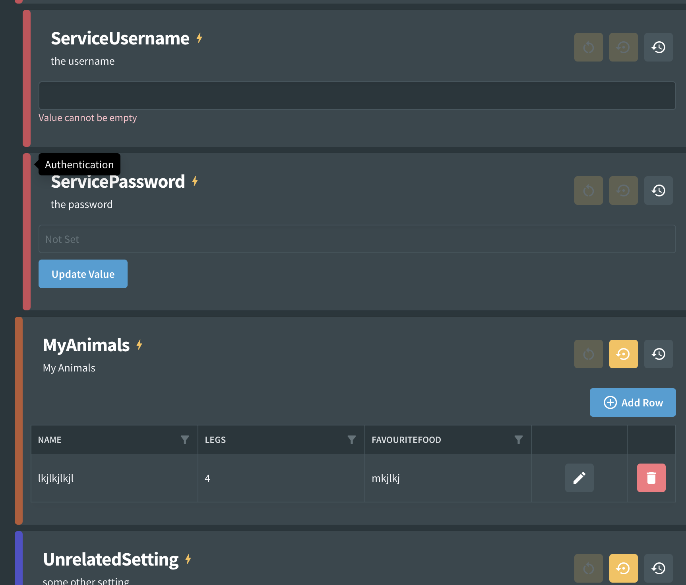

# Category

It is possible to display an association between different settings using the category feature. When a setting is assigned a category, it is assigned a category name and a color which will visually indicate that it is related to other settings with the same color and category name.

## Usage

```csharp
[Setting("the username")]
[Category("Authentication", CategoryColor.Red)]
public string? ServiceUsername { get; set; }
```

It is also possible to manually specify the color

```csharp
[Setting("the username")]
[Category("Authentication", "#6d8750")]
public string? ServiceUsername { get; set; }
```

From Fig 2.0 you can just specify the category from a predefined list:

```csharp
[Setting("the username")]
[Category(Category.Authentication)]
public string? ServiceUsername { get; set; }
```

This will automatically select the color and name leading to a more consistent experience when applications are developed across teams.

## Custom Predefined Categories

While Fig includes built-in predefined categories (like `Authentication`, `Database`, `Logging`, etc.), you can also create your own custom predefined categories that can be shared across multiple applications in your solution.

Custom predefined categories allow multiple applications to use the same names and colors for categories, making a full solution appear more consistent and coherent.

### Creating Custom Categories

To create custom categories, define an enum with `CategoryName` and `ColorHex` attributes:

```csharp
public enum MyCustomCategories
{
    [CategoryName("Payment Processing")]
    [ColorHex("#FF5733")]
    PaymentProcessing,

    [CategoryName("User Management")]
    [ColorHex("#33FF57")]
    UserManagement,

    [CategoryName("Audit & Compliance")]
    [ColorHex("#3357FF")]
    AuditCompliance
}
```

### Using Custom Categories

Once defined, you can use your custom categories in settings:

```csharp
[Setting("Payment gateway API key")]
[Category<MyCustomCategories>(MyCustomCategories.PaymentProcessing)]
[Secret]
public string? PaymentApiKey { get; set; }

[Setting("User session timeout in minutes")]
[Category<MyCustomCategories>(MyCustomCategories.UserManagement)]
public int SessionTimeoutMinutes { get; set; } = 30;
```

### Benefits of Custom Predefined Categories

- **Consistency**: All applications in your solution use the same category names and colors
- **Maintainability**: Category definitions are centralized and can be shared via a common library
- **Team Collaboration**: Developers across teams use consistent categorization
- **Visual Cohesion**: Settings across different applications have a unified appearance

### Built-in Categories

Fig includes the following built-in predefined categories:

- Authentication
- Database  
- Elasticsearch
- File Handling
- Map
- Message Bus
- API Integration
- Logging
- Business Logic
- Testing
- Property Mapping
- REST API
- Security

## Appearance

The category name appears as a tooltip.


